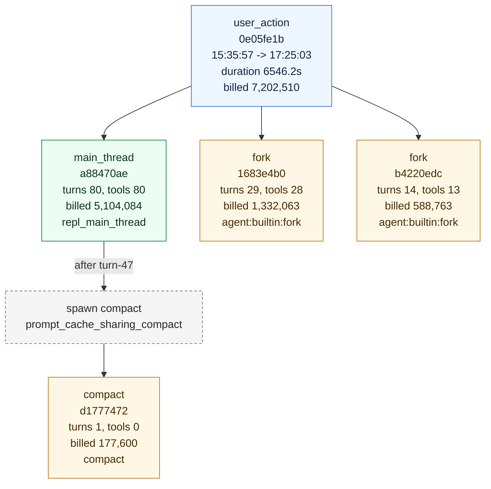

# Action Report

This report is generated directly from the current .observability files and DuckDB facts. Copy either Mermaid block into Mermaid Live Editor to visualize the graph.

## Basics

- user_action_id: 0e05fe1b-ece6-4f6b-9f90-b862e0e88308
- UTC: 2026-05-07T07:35:57.470Z -> 2026-05-07T09:25:03.667Z
- Local: 2026-05-07 15:35:57 -> 2026-05-07 17:25:03
- duration_ms: 6546197
- query_count: 4
- subagent_count: 3
- tool_call_count: 121
- total_prompt_input_tokens: 7149935
- total_billed_tokens: 7202510
- main_thread_total_prompt_input_tokens: 5063820
- subagent_total_prompt_input_tokens: 2086115

## Summary

This action expanded into 4 queries and  subagents.

## Diagram Reading Guide

- Blue node: whole user action.
- Green node: main-thread query.
- Orange node: subagent query.
- Dashed gray node: subagent spawn decision.
- Red bordered turn: incomplete or suspicious closure state.
- Node labels intentionally show only high-signal fields: turns/tools, billed tokens, duration, terminal state, and trigger detail.

## Mermaid Overview



## Mermaid Detailed DAG

```mermaid
flowchart TD
  UA["user_action<br/>0e05fe1b<br/>queries 4, subagents 3, tools 121<br/>duration 6546.2s<br/>billed 7,202,510"]
  classDef action fill:#eef6ff,stroke:#2f6fed,stroke-width:1px,color:#10233f
  classDef main fill:#ecfdf3,stroke:#16803c,stroke-width:1px,color:#0c331b
  classDef subagent fill:#fff7e6,stroke:#b7791f,stroke-width:1px,color:#442a05
  classDef turn fill:#ffffff,stroke:#a3a3a3,stroke-width:1px,color:#262626
  classDef spawn fill:#f5f5f5,stroke:#737373,stroke-dasharray: 4 3,color:#262626
  classDef warn fill:#fff1f2,stroke:#e11d48,stroke-width:2px,color:#4c0519
  class UA action
  Q_a88470ae["main_thread<br/>a88470ae<br/>turns 80, tools 80<br/>billed 5,104,084<br/>duration 6546.2s<br/>completed"]
  class Q_a88470ae main
  Q_1683e4b0["fork<br/>1683e4b0<br/>turns 29, tools 28<br/>billed 1,332,063<br/>duration 1948s<br/>completed"]
  class Q_1683e4b0 subagent
  Q_b4220edc["fork<br/>b4220edc<br/>turns 14, tools 13<br/>billed 588,763<br/>duration 1230.6s<br/>completed"]
  class Q_b4220edc subagent
  Q_d1777472["compact<br/>d1777472<br/>turns 1, tools 0<br/>billed 177,600<br/>duration 98.5s<br/>completed"]
  class Q_d1777472 subagent
  T_a88470ae_turn_1["turn-1<br/>Read<br/>loop=1<br/>duration 22.3s"]
  class T_a88470ae_turn_1 turn
  T_a88470ae_turn_2["turn-2<br/>Agent x2<br/>loop=2<br/>duration 28.2s"]
  class T_a88470ae_turn_2 turn
  T_1683e4b0_turn_1["turn-1<br/>Bash<br/>loop=1<br/>duration 109s"]
  class T_1683e4b0_turn_1 turn
  T_b4220edc_turn_1["turn-1<br/>Bash<br/>loop=1<br/>duration 108.9s"]
  class T_b4220edc_turn_1 turn
  T_a88470ae_turn_3["turn-3<br/>Bash<br/>loop=3<br/>duration 123.1s"]
  class T_a88470ae_turn_3 turn
  T_1683e4b0_turn_2["turn-2<br/>TaskOutput<br/>loop=2<br/>duration 12.5s"]
  class T_1683e4b0_turn_2 turn
  T_b4220edc_turn_2["turn-2<br/>Bash<br/>loop=2<br/>duration 17.3s"]
  class T_b4220edc_turn_2 turn
  T_1683e4b0_turn_3["turn-3<br/>Bash<br/>loop=3<br/>duration 102.9s"]
  class T_1683e4b0_turn_3 turn
  T_a88470ae_turn_4["turn-4<br/>Bash<br/>loop=4<br/>duration 101.1s"]
  class T_a88470ae_turn_4 turn
  T_b4220edc_turn_3["turn-3<br/>Bash<br/>loop=3<br/>duration 99.9s"]
  class T_b4220edc_turn_3 turn
  T_1683e4b0_turn_4["turn-4<br/>Bash<br/>loop=4<br/>duration 16.4s"]
  class T_1683e4b0_turn_4 turn
  T_a88470ae_turn_5["turn-5<br/>Bash<br/>loop=5<br/>duration 40.6s"]
  class T_a88470ae_turn_5 turn
  T_b4220edc_turn_4["turn-4<br/>Bash<br/>loop=4<br/>duration 39.3s"]
  class T_b4220edc_turn_4 turn
  T_1683e4b0_turn_5["turn-5<br/>Bash<br/>loop=5<br/>duration 47.5s"]
  class T_1683e4b0_turn_5 turn
  T_a88470ae_turn_6["turn-6<br/>Bash<br/>loop=6<br/>duration 139.6s"]
  class T_a88470ae_turn_6 turn
  T_b4220edc_turn_5["turn-5<br/>Bash<br/>loop=5<br/>duration 142.3s"]
  class T_b4220edc_turn_5 turn
  T_1683e4b0_turn_6["turn-6<br/>Bash<br/>loop=6<br/>duration 121s"]
  class T_1683e4b0_turn_6 turn
  T_a88470ae_turn_7["turn-7<br/>Bash<br/>loop=7<br/>duration 23.5s"]
  class T_a88470ae_turn_7 turn
  T_b4220edc_turn_6["turn-6<br/>Bash<br/>loop=6<br/>duration 42.1s"]
  class T_b4220edc_turn_6 turn
  T_1683e4b0_turn_7["turn-7<br/>Bash<br/>loop=7<br/>duration 24.7s"]
  class T_1683e4b0_turn_7 turn
  T_a88470ae_turn_8["turn-8<br/>Bash<br/>loop=8<br/>duration 35s"]
  class T_a88470ae_turn_8 turn
  T_1683e4b0_turn_8["turn-8<br/>Bash<br/>loop=8<br/>duration 33.7s"]
  class T_1683e4b0_turn_8 turn
  T_b4220edc_turn_7["turn-7<br/>Bash<br/>loop=7<br/>duration 42.8s"]
  class T_b4220edc_turn_7 turn
  T_a88470ae_turn_9["turn-9<br/>Bash<br/>loop=9<br/>duration 87.7s"]
  class T_a88470ae_turn_9 turn
  T_1683e4b0_turn_9["turn-9<br/>Read<br/>loop=9<br/>duration 71.3s"]
  class T_1683e4b0_turn_9 turn
  T_b4220edc_turn_8["turn-8<br/>Bash<br/>loop=8<br/>duration 74.4s"]
  class T_b4220edc_turn_8 turn
  T_1683e4b0_turn_10["turn-10<br/>Bash<br/>loop=10<br/>duration 28.7s"]
  class T_1683e4b0_turn_10 turn
  T_a88470ae_turn_10["turn-10<br/>Bash<br/>loop=10<br/>duration 168.7s"]
  class T_a88470ae_turn_10 turn
  T_b4220edc_turn_9["turn-9<br/>Read<br/>loop=9<br/>duration 24.1s"]
  class T_b4220edc_turn_9 turn
  T_1683e4b0_turn_11["turn-11<br/>Read<br/>loop=11<br/>duration 38.7s"]
  class T_1683e4b0_turn_11 turn
  T_b4220edc_turn_10["turn-10<br/>Bash<br/>loop=10<br/>duration 129.1s"]
  class T_b4220edc_turn_10 turn
  T_1683e4b0_turn_12["turn-12<br/>Bash<br/>loop=12<br/>duration 118s"]
  class T_1683e4b0_turn_12 turn
  T_a88470ae_turn_11["turn-11<br/>Read<br/>loop=11<br/>duration 18.5s"]
  class T_a88470ae_turn_11 turn
  T_b4220edc_turn_11["turn-11<br/>Read<br/>loop=11<br/>duration 18.7s"]
  class T_b4220edc_turn_11 turn
  T_1683e4b0_turn_13["turn-13<br/>Read<br/>loop=13<br/>duration 18.2s"]
  class T_1683e4b0_turn_13 turn
  T_a88470ae_turn_12["turn-12<br/>Read<br/>loop=12<br/>duration 68.7s"]
  class T_a88470ae_turn_12 turn
  T_b4220edc_turn_12["turn-12<br/>Bash<br/>loop=12<br/>duration 123s"]
  class T_b4220edc_turn_12 turn
  T_1683e4b0_turn_14["turn-14<br/>Bash<br/>loop=14<br/>duration 121.4s"]
  class T_1683e4b0_turn_14 turn
  T_a88470ae_turn_13["turn-13<br/>Bash<br/>loop=13<br/>duration 370.4s"]
  class T_a88470ae_turn_13 turn
  T_b4220edc_turn_13["turn-13<br/>Bash<br/>loop=13<br/>duration 315.1s"]
  class T_b4220edc_turn_13 turn
  T_1683e4b0_turn_15["turn-15<br/>Read<br/>loop=15<br/>duration 11.2s"]
  class T_1683e4b0_turn_15 turn
  T_1683e4b0_turn_16["turn-16<br/>Bash<br/>loop=16<br/>duration 305.8s"]
  class T_1683e4b0_turn_16 turn
  T_b4220edc_turn_14["turn-14<br/>end_turn<br/>loop=14<br/>duration 53.6s"]
  class T_b4220edc_turn_14 turn
  T_a88470ae_turn_14["turn-14<br/>Bash<br/>loop=14<br/>duration 61.9s"]
  class T_a88470ae_turn_14 turn
  T_1683e4b0_turn_17["turn-17<br/>Bash<br/>loop=17<br/>duration 61s"]
  class T_1683e4b0_turn_17 turn
  T_a88470ae_turn_15["turn-15<br/>Bash<br/>loop=15<br/>duration 92.2s"]
  class T_a88470ae_turn_15 turn
  T_1683e4b0_turn_18["turn-18<br/>Bash<br/>loop=18<br/>duration 86.9s"]
  class T_1683e4b0_turn_18 turn
  T_1683e4b0_turn_19["turn-19<br/>Bash<br/>loop=19<br/>duration 164.8s"]
  class T_1683e4b0_turn_19 turn
  T_a88470ae_turn_16["turn-16<br/>Bash<br/>loop=16<br/>duration 61.7s"]
  class T_a88470ae_turn_16 turn
  T_a88470ae_turn_17["turn-17<br/>Bash<br/>loop=17<br/>duration 102.1s"]
  class T_a88470ae_turn_17 turn
  T_1683e4b0_turn_20["turn-20<br/>Read<br/>loop=20<br/>duration 39.4s"]
  class T_1683e4b0_turn_20 turn
  T_a88470ae_turn_18["turn-18<br/>TaskCreate<br/>loop=18<br/>duration 36.7s"]
  class T_a88470ae_turn_18 turn
  T_a88470ae_turn_19["turn-19<br/>TaskUpdate<br/>loop=19<br/>duration 15.6s"]
  class T_a88470ae_turn_19 turn
  T_1683e4b0_turn_21["turn-21<br/>Bash<br/>loop=21<br/>duration 25.1s"]
  class T_1683e4b0_turn_21 turn
  T_a88470ae_turn_20["turn-20<br/>Bash<br/>loop=20<br/>duration 104.5s"]
  class T_a88470ae_turn_20 turn
  T_1683e4b0_turn_22["turn-22<br/>Read<br/>loop=22<br/>duration 5.8s"]
  class T_1683e4b0_turn_22 turn
  T_1683e4b0_turn_23["turn-23<br/>Read<br/>loop=23<br/>duration 21.2s"]
  class T_1683e4b0_turn_23 turn
  T_1683e4b0_turn_24["turn-24<br/>Read<br/>loop=24<br/>duration 75.7s"]
  class T_1683e4b0_turn_24 turn
  T_a88470ae_turn_21["turn-21<br/>Read<br/>loop=21<br/>duration 24.2s"]
  class T_a88470ae_turn_21 turn
  T_1683e4b0_turn_25["turn-25<br/>Read<br/>loop=25<br/>duration 10.7s"]
  class T_1683e4b0_turn_25 turn
  T_1683e4b0_turn_26["turn-26<br/>Read<br/>loop=26<br/>duration 28.8s"]
  class T_1683e4b0_turn_26 turn
  T_a88470ae_turn_22["turn-22<br/>Bash<br/>loop=22<br/>duration 43.3s"]
  class T_a88470ae_turn_22 turn
  T_1683e4b0_turn_27["turn-27<br/>Bash<br/>loop=27<br/>duration 145.5s"]
  class T_1683e4b0_turn_27 turn
  T_a88470ae_turn_23["turn-23<br/>Bash<br/>loop=23<br/>duration 227.6s"]
  class T_a88470ae_turn_23 turn
  T_1683e4b0_turn_28["turn-28<br/>Read<br/>loop=28<br/>duration 38.2s"]
  class T_1683e4b0_turn_28 turn
  T_1683e4b0_turn_29["turn-29<br/>end_turn<br/>loop=29<br/>duration 64s"]
  class T_1683e4b0_turn_29 turn
  T_a88470ae_turn_24["turn-24<br/>Bash<br/>loop=24<br/>duration 89.9s"]
  class T_a88470ae_turn_24 turn
  T_a88470ae_turn_25["turn-25<br/>Write<br/>loop=25<br/>duration 318.9s"]
  class T_a88470ae_turn_25 turn
  T_a88470ae_turn_26["turn-26<br/>Bash<br/>loop=26<br/>duration 65.9s"]
  class T_a88470ae_turn_26 turn
  T_a88470ae_turn_27["turn-27<br/>Bash<br/>loop=27<br/>duration 48.1s"]
  class T_a88470ae_turn_27 turn
  T_a88470ae_turn_28["turn-28<br/>Bash<br/>loop=28<br/>duration 92.9s"]
  class T_a88470ae_turn_28 turn
  T_a88470ae_turn_29["turn-29<br/>Bash<br/>loop=29<br/>duration 55.2s"]
  class T_a88470ae_turn_29 turn
  T_a88470ae_turn_30["turn-30<br/>Read<br/>loop=30<br/>duration 115s"]
  class T_a88470ae_turn_30 turn
  T_a88470ae_turn_31["turn-31<br/>Read<br/>loop=31<br/>duration 19s"]
  class T_a88470ae_turn_31 turn
  T_a88470ae_turn_32["turn-32<br/>Bash<br/>loop=32<br/>duration 43.5s"]
  class T_a88470ae_turn_32 turn
  T_a88470ae_turn_33["turn-33<br/>Bash<br/>loop=33<br/>duration 31.2s"]
  class T_a88470ae_turn_33 turn
  T_a88470ae_turn_34["turn-34<br/>Bash<br/>loop=34<br/>duration 18.7s"]
  class T_a88470ae_turn_34 turn
  T_a88470ae_turn_35["turn-35<br/>Bash<br/>loop=35<br/>duration 149s"]
  class T_a88470ae_turn_35 turn
  T_a88470ae_turn_36["turn-36<br/>Read<br/>loop=36<br/>duration 238.3s"]
  class T_a88470ae_turn_36 turn
  T_a88470ae_turn_37["turn-37<br/>Write<br/>loop=37<br/>duration 219.6s"]
  class T_a88470ae_turn_37 turn
  T_a88470ae_turn_38["turn-38<br/>Bash<br/>loop=38<br/>duration 49.6s"]
  class T_a88470ae_turn_38 turn
  T_a88470ae_turn_39["turn-39<br/>Bash<br/>loop=39<br/>duration 33.6s"]
  class T_a88470ae_turn_39 turn
  T_a88470ae_turn_40["turn-40<br/>Bash<br/>loop=40<br/>duration 104.8s"]
  class T_a88470ae_turn_40 turn
  T_a88470ae_turn_41["turn-41<br/>Write<br/>loop=41<br/>duration 166.8s"]
  class T_a88470ae_turn_41 turn
  T_a88470ae_turn_42["turn-42<br/>Bash<br/>loop=42<br/>duration 79.4s"]
  class T_a88470ae_turn_42 turn
  T_a88470ae_turn_43["turn-43<br/>Bash<br/>loop=43<br/>duration 118.9s"]
  class T_a88470ae_turn_43 turn
  T_a88470ae_turn_44["turn-44<br/>Bash<br/>loop=44<br/>duration 54.4s"]
  class T_a88470ae_turn_44 turn
  T_a88470ae_turn_45["turn-45<br/>Bash<br/>loop=45<br/>duration 150.1s"]
  class T_a88470ae_turn_45 turn
  T_a88470ae_turn_46["turn-46<br/>Bash<br/>loop=46<br/>duration 67.8s"]
  class T_a88470ae_turn_46 turn
  T_a88470ae_turn_47["turn-47<br/>Bash<br/>loop=47<br/>duration 150.9s"]
  class T_a88470ae_turn_47 turn
  T_d1777472_turn_1["turn-1<br/>end_turn<br/>loop=1<br/>duration 98.5s"]
  class T_d1777472_turn_1 turn
  T_a88470ae_turn_48["turn-48<br/>Bash<br/>loop=48<br/>duration 295s"]
  class T_a88470ae_turn_48 turn
  T_a88470ae_turn_49["turn-49<br/>Write<br/>loop=49<br/>duration 185.1s"]
  class T_a88470ae_turn_49 turn
  T_a88470ae_turn_50["turn-50<br/>Bash<br/>loop=50<br/>duration 28.5s"]
  class T_a88470ae_turn_50 turn
  T_a88470ae_turn_51["turn-51<br/>Bash<br/>loop=51<br/>duration 18.3s"]
  class T_a88470ae_turn_51 turn
  T_a88470ae_turn_52["turn-52<br/>Bash<br/>loop=52<br/>duration 24.4s"]
  class T_a88470ae_turn_52 turn
  T_a88470ae_turn_53["turn-53<br/>Bash<br/>loop=53<br/>duration 91.8s"]
  class T_a88470ae_turn_53 turn
  T_a88470ae_turn_54["turn-54<br/>Bash<br/>loop=54<br/>duration 24.1s"]
  class T_a88470ae_turn_54 turn
  T_a88470ae_turn_55["turn-55<br/>Edit<br/>loop=55<br/>duration 34.1s"]
  class T_a88470ae_turn_55 turn
  T_a88470ae_turn_56["turn-56<br/>Bash<br/>loop=56<br/>duration 14.7s"]
  class T_a88470ae_turn_56 turn
  T_a88470ae_turn_57["turn-57<br/>Bash<br/>loop=57<br/>duration 159.1s"]
  class T_a88470ae_turn_57 turn
  T_a88470ae_turn_58["turn-58<br/>Read<br/>loop=58<br/>duration 23.3s"]
  class T_a88470ae_turn_58 turn
  T_a88470ae_turn_59["turn-59<br/>Bash<br/>loop=59<br/>duration 14.8s"]
  class T_a88470ae_turn_59 turn
  T_a88470ae_turn_60["turn-60<br/>Bash<br/>loop=60<br/>duration 151.1s"]
  class T_a88470ae_turn_60 turn
  T_a88470ae_turn_61["turn-61<br/>Bash<br/>loop=61<br/>duration 402.8s"]
  class T_a88470ae_turn_61 turn
  T_a88470ae_turn_62["turn-62<br/>Read<br/>loop=62<br/>duration 12.5s"]
  class T_a88470ae_turn_62 turn
  T_a88470ae_turn_63["turn-63<br/>Edit<br/>loop=63<br/>duration 42.2s"]
  class T_a88470ae_turn_63 turn
  T_a88470ae_turn_64["turn-64<br/>Bash<br/>loop=64<br/>duration 18.4s"]
  class T_a88470ae_turn_64 turn
  T_a88470ae_turn_65["turn-65<br/>Read<br/>loop=65<br/>duration 21.3s"]
  class T_a88470ae_turn_65 turn
  T_a88470ae_turn_66["turn-66<br/>Edit<br/>loop=66<br/>duration 86.1s"]
  class T_a88470ae_turn_66 turn
  T_a88470ae_turn_67["turn-67<br/>Edit<br/>loop=67<br/>duration 30.3s"]
  class T_a88470ae_turn_67 turn
  T_a88470ae_turn_68["turn-68<br/>Edit<br/>loop=68<br/>duration 16.8s"]
  class T_a88470ae_turn_68 turn
  T_a88470ae_turn_69["turn-69<br/>Bash<br/>loop=69<br/>duration 26.2s"]
  class T_a88470ae_turn_69 turn
  T_a88470ae_turn_70["turn-70<br/>Read<br/>loop=70<br/>duration 18.5s"]
  class T_a88470ae_turn_70 turn
  T_a88470ae_turn_71["turn-71<br/>Edit<br/>loop=71<br/>duration 47.3s"]
  class T_a88470ae_turn_71 turn
  T_a88470ae_turn_72["turn-72<br/>Bash<br/>loop=72<br/>duration 18.7s"]
  class T_a88470ae_turn_72 turn
  T_a88470ae_turn_73["turn-73<br/>Read<br/>loop=73<br/>duration 27.9s"]
  class T_a88470ae_turn_73 turn
  T_a88470ae_turn_74["turn-74<br/>Edit<br/>loop=74<br/>duration 53.2s"]
  class T_a88470ae_turn_74 turn
  T_a88470ae_turn_75["turn-75<br/>Bash<br/>loop=75<br/>duration 27.2s"]
  class T_a88470ae_turn_75 turn
  T_a88470ae_turn_76["turn-76<br/>Read<br/>loop=76<br/>duration 62.9s"]
  class T_a88470ae_turn_76 turn
  T_a88470ae_turn_77["turn-77<br/>Read<br/>loop=77<br/>duration 11s"]
  class T_a88470ae_turn_77 turn
  T_a88470ae_turn_78["turn-78<br/>Read<br/>loop=78<br/>duration 29.7s"]
  class T_a88470ae_turn_78 turn
  T_a88470ae_turn_79["turn-79<br/>TaskUpdate<br/>loop=79<br/>duration 26.7s"]
  class T_a88470ae_turn_79 turn
  T_a88470ae_turn_80["turn-80<br/>end_turn<br/>loop=80<br/>duration 23.4s"]
  class T_a88470ae_turn_80 turn
  Q_a88470ae --> T_a88470ae_turn_1
  T_a88470ae_turn_1 --> T_a88470ae_turn_2
  T_a88470ae_turn_2 --> T_a88470ae_turn_3
  T_a88470ae_turn_3 --> T_a88470ae_turn_4
  T_a88470ae_turn_4 --> T_a88470ae_turn_5
  T_a88470ae_turn_5 --> T_a88470ae_turn_6
  T_a88470ae_turn_6 --> T_a88470ae_turn_7
  T_a88470ae_turn_7 --> T_a88470ae_turn_8
  T_a88470ae_turn_8 --> T_a88470ae_turn_9
  T_a88470ae_turn_9 --> T_a88470ae_turn_10
  T_a88470ae_turn_10 --> T_a88470ae_turn_11
  T_a88470ae_turn_11 --> T_a88470ae_turn_12
  T_a88470ae_turn_12 --> T_a88470ae_turn_13
  T_a88470ae_turn_13 --> T_a88470ae_turn_14
  T_a88470ae_turn_14 --> T_a88470ae_turn_15
  T_a88470ae_turn_15 --> T_a88470ae_turn_16
  T_a88470ae_turn_16 --> T_a88470ae_turn_17
  T_a88470ae_turn_17 --> T_a88470ae_turn_18
  T_a88470ae_turn_18 --> T_a88470ae_turn_19
  T_a88470ae_turn_19 --> T_a88470ae_turn_20
  T_a88470ae_turn_20 --> T_a88470ae_turn_21
  T_a88470ae_turn_21 --> T_a88470ae_turn_22
  T_a88470ae_turn_22 --> T_a88470ae_turn_23
  T_a88470ae_turn_23 --> T_a88470ae_turn_24
  T_a88470ae_turn_24 --> T_a88470ae_turn_25
  T_a88470ae_turn_25 --> T_a88470ae_turn_26
  T_a88470ae_turn_26 --> T_a88470ae_turn_27
  T_a88470ae_turn_27 --> T_a88470ae_turn_28
  T_a88470ae_turn_28 --> T_a88470ae_turn_29
  T_a88470ae_turn_29 --> T_a88470ae_turn_30
  T_a88470ae_turn_30 --> T_a88470ae_turn_31
  T_a88470ae_turn_31 --> T_a88470ae_turn_32
  T_a88470ae_turn_32 --> T_a88470ae_turn_33
  T_a88470ae_turn_33 --> T_a88470ae_turn_34
  T_a88470ae_turn_34 --> T_a88470ae_turn_35
  T_a88470ae_turn_35 --> T_a88470ae_turn_36
  T_a88470ae_turn_36 --> T_a88470ae_turn_37
  T_a88470ae_turn_37 --> T_a88470ae_turn_38
  T_a88470ae_turn_38 --> T_a88470ae_turn_39
  T_a88470ae_turn_39 --> T_a88470ae_turn_40
  T_a88470ae_turn_40 --> T_a88470ae_turn_41
  T_a88470ae_turn_41 --> T_a88470ae_turn_42
  T_a88470ae_turn_42 --> T_a88470ae_turn_43
  T_a88470ae_turn_43 --> T_a88470ae_turn_44
  T_a88470ae_turn_44 --> T_a88470ae_turn_45
  T_a88470ae_turn_45 --> T_a88470ae_turn_46
  T_a88470ae_turn_46 --> T_a88470ae_turn_47
  T_a88470ae_turn_47 --> T_a88470ae_turn_48
  T_a88470ae_turn_48 --> T_a88470ae_turn_49
  T_a88470ae_turn_49 --> T_a88470ae_turn_50
  T_a88470ae_turn_50 --> T_a88470ae_turn_51
  T_a88470ae_turn_51 --> T_a88470ae_turn_52
  T_a88470ae_turn_52 --> T_a88470ae_turn_53
  T_a88470ae_turn_53 --> T_a88470ae_turn_54
  T_a88470ae_turn_54 --> T_a88470ae_turn_55
  T_a88470ae_turn_55 --> T_a88470ae_turn_56
  T_a88470ae_turn_56 --> T_a88470ae_turn_57
  T_a88470ae_turn_57 --> T_a88470ae_turn_58
  T_a88470ae_turn_58 --> T_a88470ae_turn_59
  T_a88470ae_turn_59 --> T_a88470ae_turn_60
  T_a88470ae_turn_60 --> T_a88470ae_turn_61
  T_a88470ae_turn_61 --> T_a88470ae_turn_62
  T_a88470ae_turn_62 --> T_a88470ae_turn_63
  T_a88470ae_turn_63 --> T_a88470ae_turn_64
  T_a88470ae_turn_64 --> T_a88470ae_turn_65
  T_a88470ae_turn_65 --> T_a88470ae_turn_66
  T_a88470ae_turn_66 --> T_a88470ae_turn_67
  T_a88470ae_turn_67 --> T_a88470ae_turn_68
  T_a88470ae_turn_68 --> T_a88470ae_turn_69
  T_a88470ae_turn_69 --> T_a88470ae_turn_70
  T_a88470ae_turn_70 --> T_a88470ae_turn_71
  T_a88470ae_turn_71 --> T_a88470ae_turn_72
  T_a88470ae_turn_72 --> T_a88470ae_turn_73
  T_a88470ae_turn_73 --> T_a88470ae_turn_74
  T_a88470ae_turn_74 --> T_a88470ae_turn_75
  T_a88470ae_turn_75 --> T_a88470ae_turn_76
  T_a88470ae_turn_76 --> T_a88470ae_turn_77
  T_a88470ae_turn_77 --> T_a88470ae_turn_78
  T_a88470ae_turn_78 --> T_a88470ae_turn_79
  T_a88470ae_turn_79 --> T_a88470ae_turn_80
  Q_1683e4b0 --> T_1683e4b0_turn_1
  T_1683e4b0_turn_1 --> T_1683e4b0_turn_2
  T_1683e4b0_turn_2 --> T_1683e4b0_turn_3
  T_1683e4b0_turn_3 --> T_1683e4b0_turn_4
  T_1683e4b0_turn_4 --> T_1683e4b0_turn_5
  T_1683e4b0_turn_5 --> T_1683e4b0_turn_6
  T_1683e4b0_turn_6 --> T_1683e4b0_turn_7
  T_1683e4b0_turn_7 --> T_1683e4b0_turn_8
  T_1683e4b0_turn_8 --> T_1683e4b0_turn_9
  T_1683e4b0_turn_9 --> T_1683e4b0_turn_10
  T_1683e4b0_turn_10 --> T_1683e4b0_turn_11
  T_1683e4b0_turn_11 --> T_1683e4b0_turn_12
  T_1683e4b0_turn_12 --> T_1683e4b0_turn_13
  T_1683e4b0_turn_13 --> T_1683e4b0_turn_14
  T_1683e4b0_turn_14 --> T_1683e4b0_turn_15
  T_1683e4b0_turn_15 --> T_1683e4b0_turn_16
  T_1683e4b0_turn_16 --> T_1683e4b0_turn_17
  T_1683e4b0_turn_17 --> T_1683e4b0_turn_18
  T_1683e4b0_turn_18 --> T_1683e4b0_turn_19
  T_1683e4b0_turn_19 --> T_1683e4b0_turn_20
  T_1683e4b0_turn_20 --> T_1683e4b0_turn_21
  T_1683e4b0_turn_21 --> T_1683e4b0_turn_22
  T_1683e4b0_turn_22 --> T_1683e4b0_turn_23
  T_1683e4b0_turn_23 --> T_1683e4b0_turn_24
  T_1683e4b0_turn_24 --> T_1683e4b0_turn_25
  T_1683e4b0_turn_25 --> T_1683e4b0_turn_26
  T_1683e4b0_turn_26 --> T_1683e4b0_turn_27
  T_1683e4b0_turn_27 --> T_1683e4b0_turn_28
  T_1683e4b0_turn_28 --> T_1683e4b0_turn_29
  Q_b4220edc --> T_b4220edc_turn_1
  T_b4220edc_turn_1 --> T_b4220edc_turn_2
  T_b4220edc_turn_2 --> T_b4220edc_turn_3
  T_b4220edc_turn_3 --> T_b4220edc_turn_4
  T_b4220edc_turn_4 --> T_b4220edc_turn_5
  T_b4220edc_turn_5 --> T_b4220edc_turn_6
  T_b4220edc_turn_6 --> T_b4220edc_turn_7
  T_b4220edc_turn_7 --> T_b4220edc_turn_8
  T_b4220edc_turn_8 --> T_b4220edc_turn_9
  T_b4220edc_turn_9 --> T_b4220edc_turn_10
  T_b4220edc_turn_10 --> T_b4220edc_turn_11
  T_b4220edc_turn_11 --> T_b4220edc_turn_12
  T_b4220edc_turn_12 --> T_b4220edc_turn_13
  T_b4220edc_turn_13 --> T_b4220edc_turn_14
  Q_d1777472 --> T_d1777472_turn_1
  S_1["spawn compact<br/>prompt_cache_sharing_compact<br/>16:48:05"]
  class S_1 spawn
  T_a88470ae_turn_47 --> S_1 --> Q_d1777472
  UA --> Q_a88470ae
  UA --> Q_1683e4b0
  UA --> Q_b4220edc
```

## Query List

### main_thread a88470ae-eb8f-4275-a414-81783f46558f

- query_source: repl_main_thread
- subagent_reason: repl_main_thread
- subagent_trigger_kind: 
- subagent_trigger_detail: 
- time: 2026-05-07 15:35:57 -> 2026-05-07 17:25:03
- turn_count: 80
- max_loop_iter: 80.0
- tool_call_count: 80
- total_prompt_input_tokens: 5063820
- total_billed_tokens: 5104084
- terminal_reason: completed
- completeness: strict=true, inferred=true

- turn-1: tools=Read, stop_reason=tool_use, transition_out=next_turn, duration_ms=22251, strict_closed=true
- turn-2: tools=Agent x2, stop_reason=tool_use, transition_out=next_turn, duration_ms=28234, strict_closed=true
- turn-3: tools=Bash, stop_reason=tool_use, transition_out=next_turn, duration_ms=123099, strict_closed=true
- turn-4: tools=Bash, stop_reason=tool_use, transition_out=next_turn, duration_ms=101087, strict_closed=true
- turn-5: tools=Bash, stop_reason=tool_use, transition_out=next_turn, duration_ms=40639, strict_closed=true
- turn-6: tools=Bash, stop_reason=tool_use, transition_out=next_turn, duration_ms=139578, strict_closed=true
- turn-7: tools=Bash, stop_reason=tool_use, transition_out=next_turn, duration_ms=23542, strict_closed=true
- turn-8: tools=Bash, stop_reason=tool_use, transition_out=next_turn, duration_ms=34951, strict_closed=true
- turn-9: tools=Bash, stop_reason=tool_use, transition_out=next_turn, duration_ms=87699, strict_closed=true
- turn-10: tools=Bash, stop_reason=tool_use, transition_out=next_turn, duration_ms=168747, strict_closed=true
- turn-11: tools=Read, stop_reason=tool_use, transition_out=next_turn, duration_ms=18501, strict_closed=true
- turn-12: tools=Read, stop_reason=tool_use, transition_out=next_turn, duration_ms=68687, strict_closed=true
- turn-13: tools=Bash, stop_reason=tool_use, transition_out=next_turn, duration_ms=370378, strict_closed=true
- turn-14: tools=Bash, stop_reason=tool_use, transition_out=next_turn, duration_ms=61901, strict_closed=true
- turn-15: tools=Bash, stop_reason=tool_use, transition_out=next_turn, duration_ms=92203, strict_closed=true
- turn-16: tools=Bash, stop_reason=tool_use, transition_out=next_turn, duration_ms=61653, strict_closed=true
- turn-17: tools=Bash, stop_reason=tool_use, transition_out=next_turn, duration_ms=102104, strict_closed=true
- turn-18: tools=TaskCreate, stop_reason=tool_use, transition_out=next_turn, duration_ms=36706, strict_closed=true
- turn-19: tools=TaskUpdate, stop_reason=tool_use, transition_out=next_turn, duration_ms=15634, strict_closed=true
- turn-20: tools=Bash, stop_reason=tool_use, transition_out=next_turn, duration_ms=104510, strict_closed=true
- turn-21: tools=Read, stop_reason=tool_use, transition_out=next_turn, duration_ms=24199, strict_closed=true
- turn-22: tools=Bash, stop_reason=tool_use, transition_out=next_turn, duration_ms=43261, strict_closed=true
- turn-23: tools=Bash, stop_reason=tool_use, transition_out=next_turn, duration_ms=227599, strict_closed=true
- turn-24: tools=Bash, stop_reason=tool_use, transition_out=next_turn, duration_ms=89907, strict_closed=true
- turn-25: tools=Write, stop_reason=tool_use, transition_out=next_turn, duration_ms=318860, strict_closed=true
- turn-26: tools=Bash, stop_reason=tool_use, transition_out=next_turn, duration_ms=65895, strict_closed=true
- turn-27: tools=Bash, stop_reason=tool_use, transition_out=next_turn, duration_ms=48054, strict_closed=true
- turn-28: tools=Bash, stop_reason=tool_use, transition_out=next_turn, duration_ms=92876, strict_closed=true
- turn-29: tools=Bash, stop_reason=tool_use, transition_out=next_turn, duration_ms=55161, strict_closed=true
- turn-30: tools=Read, stop_reason=tool_use, transition_out=next_turn, duration_ms=115032, strict_closed=true
- turn-31: tools=Read, stop_reason=tool_use, transition_out=next_turn, duration_ms=18951, strict_closed=true
- turn-32: tools=Bash, stop_reason=tool_use, transition_out=next_turn, duration_ms=43460, strict_closed=true
- turn-33: tools=Bash, stop_reason=tool_use, transition_out=next_turn, duration_ms=31213, strict_closed=true
- turn-34: tools=Bash, stop_reason=tool_use, transition_out=next_turn, duration_ms=18718, strict_closed=true
- turn-35: tools=Bash, stop_reason=tool_use, transition_out=next_turn, duration_ms=149049, strict_closed=true
- turn-36: tools=Read, stop_reason=tool_use, transition_out=next_turn, duration_ms=238341, strict_closed=true
- turn-37: tools=Write, stop_reason=tool_use, transition_out=next_turn, duration_ms=219608, strict_closed=true
- turn-38: tools=Bash, stop_reason=tool_use, transition_out=next_turn, duration_ms=49593, strict_closed=true
- turn-39: tools=Bash, stop_reason=tool_use, transition_out=next_turn, duration_ms=33574, strict_closed=true
- turn-40: tools=Bash, stop_reason=tool_use, transition_out=next_turn, duration_ms=104786, strict_closed=true
- turn-41: tools=Write, stop_reason=tool_use, transition_out=next_turn, duration_ms=166798, strict_closed=true
- turn-42: tools=Bash, stop_reason=tool_use, transition_out=next_turn, duration_ms=79403, strict_closed=true
- turn-43: tools=Bash, stop_reason=tool_use, transition_out=next_turn, duration_ms=118867, strict_closed=true
- turn-44: tools=Bash, stop_reason=tool_use, transition_out=next_turn, duration_ms=54392, strict_closed=true
- turn-45: tools=Bash, stop_reason=tool_use, transition_out=next_turn, duration_ms=150062, strict_closed=true
- turn-46: tools=Bash, stop_reason=tool_use, transition_out=next_turn, duration_ms=67800, strict_closed=true
- turn-47: tools=Bash, stop_reason=tool_use, transition_out=next_turn, duration_ms=150933, strict_closed=true
- turn-48: tools=Bash, stop_reason=tool_use, transition_out=next_turn, duration_ms=295017, strict_closed=true
- turn-49: tools=Write, stop_reason=tool_use, transition_out=next_turn, duration_ms=185123, strict_closed=true
- turn-50: tools=Bash, stop_reason=tool_use, transition_out=next_turn, duration_ms=28463, strict_closed=true
- turn-51: tools=Bash, stop_reason=tool_use, transition_out=next_turn, duration_ms=18271, strict_closed=true
- turn-52: tools=Bash, stop_reason=tool_use, transition_out=next_turn, duration_ms=24450, strict_closed=true
- turn-53: tools=Bash, stop_reason=tool_use, transition_out=next_turn, duration_ms=91796, strict_closed=true
- turn-54: tools=Bash, stop_reason=tool_use, transition_out=next_turn, duration_ms=24089, strict_closed=true
- turn-55: tools=Edit, stop_reason=tool_use, transition_out=next_turn, duration_ms=34094, strict_closed=true
- turn-56: tools=Bash, stop_reason=tool_use, transition_out=next_turn, duration_ms=14694, strict_closed=true
- turn-57: tools=Bash, stop_reason=tool_use, transition_out=next_turn, duration_ms=159071, strict_closed=true
- turn-58: tools=Read, stop_reason=tool_use, transition_out=next_turn, duration_ms=23268, strict_closed=true
- turn-59: tools=Bash, stop_reason=tool_use, transition_out=next_turn, duration_ms=14767, strict_closed=true
- turn-60: tools=Bash, stop_reason=tool_use, transition_out=next_turn, duration_ms=151085, strict_closed=true
- turn-61: tools=Bash, stop_reason=tool_use, transition_out=next_turn, duration_ms=402767, strict_closed=true
- turn-62: tools=Read, stop_reason=tool_use, transition_out=next_turn, duration_ms=12533, strict_closed=true
- turn-63: tools=Edit, stop_reason=tool_use, transition_out=next_turn, duration_ms=42196, strict_closed=true
- turn-64: tools=Bash, stop_reason=tool_use, transition_out=next_turn, duration_ms=18355, strict_closed=true
- turn-65: tools=Read, stop_reason=tool_use, transition_out=next_turn, duration_ms=21292, strict_closed=true
- turn-66: tools=Edit, stop_reason=tool_use, transition_out=next_turn, duration_ms=86130, strict_closed=true
- turn-67: tools=Edit, stop_reason=tool_use, transition_out=next_turn, duration_ms=30265, strict_closed=true
- turn-68: tools=Edit, stop_reason=tool_use, transition_out=next_turn, duration_ms=16768, strict_closed=true
- turn-69: tools=Bash, stop_reason=tool_use, transition_out=next_turn, duration_ms=26208, strict_closed=true
- turn-70: tools=Read, stop_reason=tool_use, transition_out=next_turn, duration_ms=18514, strict_closed=true
- turn-71: tools=Edit, stop_reason=tool_use, transition_out=next_turn, duration_ms=47347, strict_closed=true
- turn-72: tools=Bash, stop_reason=tool_use, transition_out=next_turn, duration_ms=18720, strict_closed=true
- turn-73: tools=Read, stop_reason=tool_use, transition_out=next_turn, duration_ms=27910, strict_closed=true
- turn-74: tools=Edit, stop_reason=tool_use, transition_out=next_turn, duration_ms=53163, strict_closed=true
- turn-75: tools=Bash, stop_reason=tool_use, transition_out=next_turn, duration_ms=27181, strict_closed=true
- turn-76: tools=Read, stop_reason=tool_use, transition_out=next_turn, duration_ms=62885, strict_closed=true
- turn-77: tools=Read, stop_reason=tool_use, transition_out=next_turn, duration_ms=10968, strict_closed=true
- turn-78: tools=Read, stop_reason=tool_use, transition_out=next_turn, duration_ms=29705, strict_closed=true
- turn-79: tools=TaskUpdate, stop_reason=tool_use, transition_out=next_turn, duration_ms=26694, strict_closed=true
- turn-80: tools=none, stop_reason=end_turn, transition_out=, duration_ms=23439, strict_closed=true

### fork 1683e4b0-01ef-4df9-a9d1-cc3baef3c277

- query_source: agent:builtin:fork
- subagent_reason: agent:builtin:fork
- subagent_trigger_kind: 
- subagent_trigger_detail: 
- time: 2026-05-07 15:36:47 -> 2026-05-07 16:09:15
- turn_count: 29
- max_loop_iter: 29.0
- tool_call_count: 28
- total_prompt_input_tokens: 1326920
- total_billed_tokens: 1332063
- terminal_reason: completed
- completeness: strict=true, inferred=true

- turn-1: tools=Bash, stop_reason=tool_use, transition_out=next_turn, duration_ms=109013, strict_closed=true
- turn-2: tools=TaskOutput, stop_reason=tool_use, transition_out=next_turn, duration_ms=12479, strict_closed=true
- turn-3: tools=Bash, stop_reason=tool_use, transition_out=next_turn, duration_ms=102904, strict_closed=true
- turn-4: tools=Bash, stop_reason=tool_use, transition_out=next_turn, duration_ms=16366, strict_closed=true
- turn-5: tools=Bash, stop_reason=tool_use, transition_out=next_turn, duration_ms=47541, strict_closed=true
- turn-6: tools=Bash, stop_reason=tool_use, transition_out=next_turn, duration_ms=121018, strict_closed=true
- turn-7: tools=Bash, stop_reason=tool_use, transition_out=next_turn, duration_ms=24675, strict_closed=true
- turn-8: tools=Bash, stop_reason=tool_use, transition_out=next_turn, duration_ms=33729, strict_closed=true
- turn-9: tools=Read, stop_reason=tool_use, transition_out=next_turn, duration_ms=71274, strict_closed=true
- turn-10: tools=Bash, stop_reason=tool_use, transition_out=next_turn, duration_ms=28713, strict_closed=true
- turn-11: tools=Read, stop_reason=tool_use, transition_out=next_turn, duration_ms=38683, strict_closed=true
- turn-12: tools=Bash, stop_reason=tool_use, transition_out=next_turn, duration_ms=117983, strict_closed=true
- turn-13: tools=Read, stop_reason=tool_use, transition_out=next_turn, duration_ms=18213, strict_closed=true
- turn-14: tools=Bash, stop_reason=tool_use, transition_out=next_turn, duration_ms=121377, strict_closed=true
- turn-15: tools=Read, stop_reason=tool_use, transition_out=next_turn, duration_ms=11167, strict_closed=true
- turn-16: tools=Bash, stop_reason=tool_use, transition_out=next_turn, duration_ms=305827, strict_closed=true
- turn-17: tools=Bash, stop_reason=tool_use, transition_out=next_turn, duration_ms=60950, strict_closed=true
- turn-18: tools=Bash, stop_reason=tool_use, transition_out=next_turn, duration_ms=86919, strict_closed=true
- turn-19: tools=Bash, stop_reason=tool_use, transition_out=next_turn, duration_ms=164833, strict_closed=true
- turn-20: tools=Read, stop_reason=tool_use, transition_out=next_turn, duration_ms=39411, strict_closed=true
- turn-21: tools=Bash, stop_reason=tool_use, transition_out=next_turn, duration_ms=25104, strict_closed=true
- turn-22: tools=Read, stop_reason=tool_use, transition_out=next_turn, duration_ms=5751, strict_closed=true
- turn-23: tools=Read, stop_reason=tool_use, transition_out=next_turn, duration_ms=21181, strict_closed=true
- turn-24: tools=Read, stop_reason=tool_use, transition_out=next_turn, duration_ms=75735, strict_closed=true
- turn-25: tools=Read, stop_reason=tool_use, transition_out=next_turn, duration_ms=10669, strict_closed=true
- turn-26: tools=Read, stop_reason=tool_use, transition_out=next_turn, duration_ms=28766, strict_closed=true
- turn-27: tools=Bash, stop_reason=tool_use, transition_out=next_turn, duration_ms=145477, strict_closed=true
- turn-28: tools=Read, stop_reason=tool_use, transition_out=next_turn, duration_ms=38230, strict_closed=true
- turn-29: tools=none, stop_reason=end_turn, transition_out=, duration_ms=63997, strict_closed=true

### fork b4220edc-0c8a-49f3-bfbe-2ac7f4291fd1

- query_source: agent:builtin:fork
- subagent_reason: agent:builtin:fork
- subagent_trigger_kind: 
- subagent_trigger_detail: 
- time: 2026-05-07 15:36:47 -> 2026-05-07 15:57:18
- turn_count: 14
- max_loop_iter: 14.0
- tool_call_count: 13
- total_prompt_input_tokens: 584675
- total_billed_tokens: 588763
- terminal_reason: completed
- completeness: strict=true, inferred=true

- turn-1: tools=Bash, stop_reason=tool_use, transition_out=next_turn, duration_ms=108900, strict_closed=true
- turn-2: tools=Bash, stop_reason=tool_use, transition_out=next_turn, duration_ms=17334, strict_closed=true
- turn-3: tools=Bash, stop_reason=tool_use, transition_out=next_turn, duration_ms=99856, strict_closed=true
- turn-4: tools=Bash, stop_reason=tool_use, transition_out=next_turn, duration_ms=39257, strict_closed=true
- turn-5: tools=Bash, stop_reason=tool_use, transition_out=next_turn, duration_ms=142264, strict_closed=true
- turn-6: tools=Bash, stop_reason=tool_use, transition_out=next_turn, duration_ms=42140, strict_closed=true
- turn-7: tools=Bash, stop_reason=tool_use, transition_out=next_turn, duration_ms=42814, strict_closed=true
- turn-8: tools=Bash, stop_reason=tool_use, transition_out=next_turn, duration_ms=74419, strict_closed=true
- turn-9: tools=Read, stop_reason=tool_use, transition_out=next_turn, duration_ms=24095, strict_closed=true
- turn-10: tools=Bash, stop_reason=tool_use, transition_out=next_turn, duration_ms=129145, strict_closed=true
- turn-11: tools=Read, stop_reason=tool_use, transition_out=next_turn, duration_ms=18703, strict_closed=true
- turn-12: tools=Bash, stop_reason=tool_use, transition_out=next_turn, duration_ms=122999, strict_closed=true
- turn-13: tools=Bash, stop_reason=tool_use, transition_out=next_turn, duration_ms=315057, strict_closed=true
- turn-14: tools=none, stop_reason=end_turn, transition_out=, duration_ms=53602, strict_closed=true

### compact d1777472-2f7e-4c8e-b931-4219e7ffb8d3

- query_source: compact
- subagent_reason: compact
- subagent_trigger_kind: compaction_flow
- subagent_trigger_detail: prompt_cache_sharing_compact
- time: 2026-05-07 16:48:05 -> 2026-05-07 16:49:43
- turn_count: 1
- max_loop_iter: 1.0
- tool_call_count: 0
- total_prompt_input_tokens: 174520
- total_billed_tokens: 177600
- terminal_reason: completed
- completeness: strict=true, inferred=true

- turn-1: tools=none, stop_reason=end_turn, transition_out=, duration_ms=98482, strict_closed=true

## Branch Points

- 2026-05-07 16:48:05: spawn compact, trigger_kind=compaction_flow, trigger_detail=prompt_cache_sharing_compact, child_query=d1777472-2f7e-4c8e-b931-4219e7ffb8d3, attached after main-thread turn-47 by time inference

## Reading SOP

1. Find the target action in user_actions.
2. Use queries to list all agents and branches under that action.
3. Use turns to inspect loop count and turn termination.
4. Use tools to inspect concrete tool calls per turn.
5. Use events_raw for key events only: query.started, api.stream.completed, subagent.spawned, query.terminated.
6. If you need content, follow snapshot refs into .observability/snapshots.

