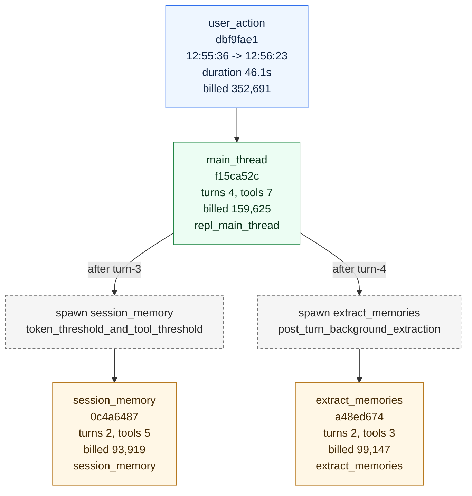
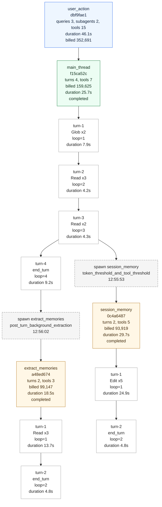

# Action Report

This report is generated directly from the current .observability files and DuckDB facts. Copy either Mermaid block into Mermaid Live Editor to visualize the graph.

## Basics

- user_action_id: dbf9fae1-0a5a-4f50-aba7-02047ced9390
- UTC: 2026-04-24T04:55:36.952Z -> 2026-04-24T04:56:23.033Z
- Local: 2026-04-24 12:55:36 -> 2026-04-24 12:56:23
- duration_ms: 46081
- query_count: 3
- subagent_count: 2
- tool_call_count: 15
- total_prompt_input_tokens: 348534
- total_billed_tokens: 352691
- main_thread_total_prompt_input_tokens: 158909
- subagent_total_prompt_input_tokens: 189625

## Summary

This action expanded into 3 queries and 2 subagents.

## Diagram Reading Guide

- Blue node: whole user action.
- Green node: main-thread query.
- Orange node: subagent query.
- Dashed gray node: subagent spawn decision.
- Red bordered turn: incomplete or suspicious closure state.
- Node labels intentionally show only high-signal fields: turns/tools, billed tokens, duration, terminal state, and trigger detail.

## Mermaid Overview

## Mermaid Detailed DAG

## Query List

### main_thread f15ca52c-e702-448a-9cd8-8d5c942ff4e2

- query_source: repl_main_thread
- subagent_reason: repl_main_thread
- subagent_trigger_kind: 
- subagent_trigger_detail: 
- time: 2026-04-24 12:55:36 -> 2026-04-24 12:56:02
- turn_count: 4
- max_loop_iter: 4.0
- tool_call_count: 7
- total_prompt_input_tokens: 158909
- total_billed_tokens: 159625
- terminal_reason: completed
- completeness: strict=true, inferred=true

- turn-1: tools=Glob x2, stop_reason=tool_use, transition_out=next_turn, duration_ms=7865, strict_closed=true
- turn-2: tools=Read x3, stop_reason=tool_use, transition_out=next_turn, duration_ms=4235, strict_closed=true
- turn-3: tools=Read x2, stop_reason=tool_use, transition_out=next_turn, duration_ms=4339, strict_closed=true
- turn-4: tools=none, stop_reason=end_turn, transition_out=, duration_ms=9245, strict_closed=true

### session_memory 0c4a6487-7294-4987-a6d9-276135e9ec34

- query_source: session_memory
- subagent_reason: session_memory
- subagent_trigger_kind: post_sampling_hook
- subagent_trigger_detail: token_threshold_and_tool_threshold
- time: 2026-04-24 12:55:53 -> 2026-04-24 12:56:23
- turn_count: 2
- max_loop_iter: 2.0
- tool_call_count: 5
- total_prompt_input_tokens: 91414
- total_billed_tokens: 93919
- terminal_reason: completed
- completeness: strict=true, inferred=true

- turn-1: tools=Edit x5, stop_reason=tool_use, transition_out=next_turn, duration_ms=24892, strict_closed=true
- turn-2: tools=none, stop_reason=end_turn, transition_out=, duration_ms=4772, strict_closed=true

### extract_memories a48ed674-8bd5-48e6-be83-576149552303

- query_source: extract_memories
- subagent_reason: extract_memories
- subagent_trigger_kind: stop_hook_background
- subagent_trigger_detail: post_turn_background_extraction
- time: 2026-04-24 12:56:02 -> 2026-04-24 12:56:21
- turn_count: 2
- max_loop_iter: 2.0
- tool_call_count: 3
- total_prompt_input_tokens: 98211
- total_billed_tokens: 99147
- terminal_reason: completed
- completeness: strict=true, inferred=true

- turn-1: tools=Read x3, stop_reason=tool_use, transition_out=next_turn, duration_ms=13669, strict_closed=true
- turn-2: tools=none, stop_reason=end_turn, transition_out=, duration_ms=4827, strict_closed=true

## Branch Points

- 2026-04-24 12:55:53: spawn session_memory, trigger_kind=post_sampling_hook, trigger_detail=token_threshold_and_tool_threshold, child_query=0c4a6487-7294-4987-a6d9-276135e9ec34, attached after main-thread turn-3 by time inference
- 2026-04-24 12:56:02: spawn extract_memories, trigger_kind=stop_hook_background, trigger_detail=post_turn_background_extraction, child_query=a48ed674-8bd5-48e6-be83-576149552303, attached after main-thread turn-4 by time inference

## Reading SOP

1. Find the target action in user_actions.
2. Use queries to list all agents and branches under that action.
3. Use turns to inspect loop count and turn termination.
4. Use tools to inspect concrete tool calls per turn.
5. Use events_raw for key events only: query.started, api.stream.completed, subagent.spawned, query.terminated.
6. If you need content, follow snapshot refs into .observability/snapshots.

