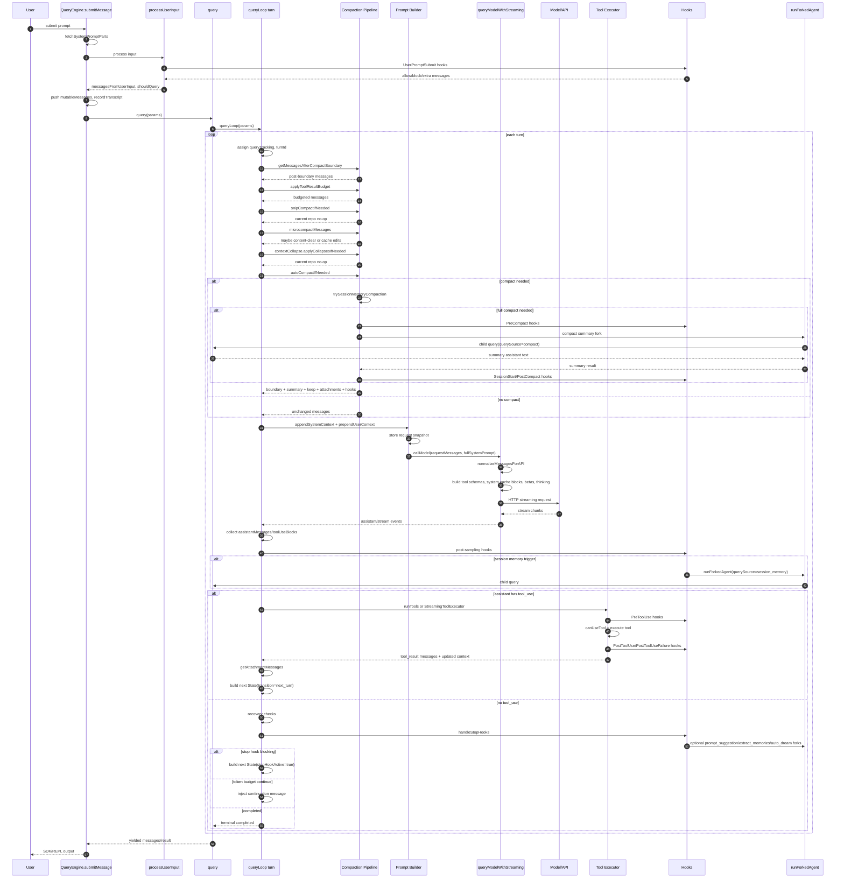
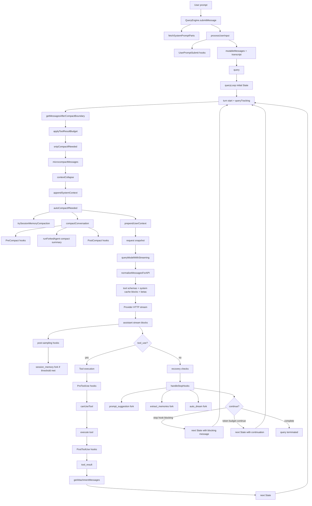

# Query Loop 全流程详解（源码版）

本文基于当前仓库 `E:\claude-code-transparent` 的源码重新整理，目标是把一次用户 query 从输入、组装 prompt、发送 API、流式响应、工具执行、上下文压缩、hook、子 agent、状态迁移到最终结束的全过程讲清楚。

重点结论先放在最前面：

- 一次用户输入不是直接变成一次 HTTP 请求。它先经过 `processUserInput`，再进入 `query()`，然后在 `queryLoop()` 的 `while (true)` 中按 turn 推进。
- 一条 query 可以包含多个 turn。只要模型返回 `tool_use`，系统就执行工具，把 `tool_result` 放回消息历史，然后进入下一轮 turn。
- 一个 user action 也可以派生出多条 query。主线程是一条 query，`runForkedAgent()` 启动的 session memory、extract memories、compact、prompt suggestion、auto dream、side question、Agent 工具等都会形成自己的独立 query loop。
- 真正发送给模型的内容不是 `state.messages` 原样。每一轮都会先做消息预处理，再构建 `systemPrompt + userContext + messages + tool schemas + thinkingConfig + beta/cache/body params`。
- 上下文压缩不是单一动作，而是一条分层管线：compact boundary 截断可见历史、tool result budget、snip、microcompact、context collapse、autocompact、reactive compact。
- 本仓库当前 `snipCompact.ts` 与 `contextCollapse/index.ts` 是 stub，所以调用链存在，但当前实现基本不改变 messages。
- hook 不是一个点，而是分布在输入提交、工具前、工具后、停止阶段、压缩前后、session start/end、notification、subagent stop 等多个阶段。

核心源码入口：

- [QueryEngine.ts](E:/claude-code-transparent/src/QueryEngine.ts:185): SDK/headless 会话级入口，维护 `mutableMessages`、transcript、read file cache。
- [query.ts](E:/claude-code-transparent/src/query.ts:527): `query()` 外壳，创建 trace 并委托给 `queryLoop()`。
- [query.ts](E:/claude-code-transparent/src/query.ts:586): `queryLoop()` 主状态机。
- [claude.ts](E:/claude-code-transparent/src/services/api/claude.ts:770): `queryModelWithStreaming()`，真正把内部 messages/system/tools 转成 API 请求并流式读取响应。
- [forkedAgent.ts](E:/claude-code-transparent/src/utils/forkedAgent.ts:499): `runForkedAgent()`，所有 forked subagent 的统一入口。

---

## 1. 先建立几个基础概念

### 1.1 user action

`user_action` 是“用户这一次动作”的根，例如用户在 REPL 中按回车提交了一条消息，或 SDK 调用了一次 `submitMessage()`。

一个 user action 可以展开成：

- 1 条主线程 query。
- 0 到多条后台 query。
- 多轮 turn。
- 多次工具调用。
- 多个 hook 执行。
- 多次 snapshot/harness event。

所以看日志时，`user_action_id` 用来把整棵执行树串起来。

### 1.2 query

`query` 是一次完整的 agent loop 生命周期。它不是“一次 HTTP 请求”，而是“一条可以多轮推进的状态机”。

主线程会调用一次 `query()`。每次 `runForkedAgent()` 也会在内部再调用一次 `query()`，因此子 agent 也有自己的 query。

源码证据：

- [query.ts](E:/claude-code-transparent/src/query.ts:527) 定义 `export async function* query(...)`。
- [forkedAgent.ts](E:/claude-code-transparent/src/utils/forkedAgent.ts:603) 在 fork 内部 `for await (const message of query({ ... }))`。

### 1.3 turn

`turn` 是 `queryLoop()` 中 `while (true)` 的一轮。

一轮 turn 通常做这些事：

1. 读取当前 `state`。
2. 生成本轮 `messagesForQuery`。
3. 做压缩和上下文裁剪。
4. 组装 request prompt。
5. 调模型。
6. 流式接收 assistant 输出。
7. 判断是否有 `tool_use`。
8. 如果有工具，执行工具并把 `tool_result` 加回 messages，然后进入下一轮。
9. 如果没有工具，执行 stop hooks、恢复链、token budget continuation 等收尾逻辑。

入口在 [query.ts](E:/claude-code-transparent/src/query.ts:723)：

```ts
while (true) {
  ...
}
```

### 1.4 query chain

`query chain` 是同一条 query 内多轮 turn 的跟踪身份。

在每轮开始时，系统会检查 `toolUseContext.queryTracking`。如果为空，说明这条 query 还没分配 chain，于是创建新的 `chainId`。后续 turn 复用同一个 `chainId`，但 `depth` 增加。

这不是“assistant 返回一堆工具然后流式执行工具”本身。更准确地说：

- chain 是 query 生命周期的追踪 ID。
- 一条 chain 内可以发生多轮模型调用。
- 每轮模型调用可以返回多个 tool_use。
- 工具执行结束后，如果继续下一轮，仍然属于同一条 chain。

对应位置：

- [query.ts](E:/claude-code-transparent/src/query.ts:762) 附近分配/延续 `queryTracking`。
- [query.ts](E:/claude-code-transparent/src/query.ts:800) 发 `query_tracking.assigned`。

### 1.5 state

`State` 是 `queryLoop()` 每轮之间携带的可变状态快照。定义在 [query.ts](E:/claude-code-transparent/src/query.ts:512)：

```ts
type State = {
  messages: Message[]
  toolUseContext: ToolUseContext
  autoCompactTracking: AutoCompactTrackingState | undefined
  maxOutputTokensRecoveryCount: number
  hasAttemptedReactiveCompact: boolean
  maxOutputTokensOverride: number | undefined
  pendingToolUseSummary: Promise<ToolUseSummaryMessage | null> | undefined
  stopHookActive: boolean | undefined
  turnCount: number
  transition: Continue | undefined
}
```

各字段含义：

- `messages`: 当前 query 认为可继续推进的消息历史。每一轮结束后会构造新的数组。
- `toolUseContext`: 工具执行上下文，包含工具列表、模型配置、readFileState、agentId、queryTracking、hooks 能访问的 app state 等。
- `autoCompactTracking`: autocompact 的跟踪信息，避免重复触发或记录压缩状态。
- `maxOutputTokensRecoveryCount`: 输出 token 超限后自动恢复的次数。
- `hasAttemptedReactiveCompact`: prompt too long 或媒体太大时，是否已经尝试过 reactive compact，避免死循环。
- `maxOutputTokensOverride`: 本轮是否临时提高输出 token 上限。
- `pendingToolUseSummary`: 上一轮工具摘要的异步任务，可能在下一轮流式响应期间完成。
- `stopHookActive`: 是否已经处于 stop hook 阻塞后的重试状态。
- `turnCount`: 当前第几轮。
- `transition`: 上一轮为什么继续到这一轮，例如 `next_turn`、`max_output_tokens_recovery`、`reactive_compact_retry`。

状态迁移集中发生在这些位置：

- [query.ts](E:/claude-code-transparent/src/query.ts:1920): collapse drain retry 构造 next state。
- [query.ts](E:/claude-code-transparent/src/query.ts:1989): reactive compact retry 构造 next state。
- [query.ts](E:/claude-code-transparent/src/query.ts:2070): max output tokens escalate 构造 next state。
- [query.ts](E:/claude-code-transparent/src/query.ts:2110): max output tokens recovery 构造 next state。
- [query.ts](E:/claude-code-transparent/src/query.ts:2186): stop hook blocking 构造 next state。
- [query.ts](E:/claude-code-transparent/src/query.ts:2694): 工具执行完成后构造正常下一轮 state。

### 1.6 boundary

`boundary` 是“边界标记消息”。它不是给用户看的普通文本，而是内部用来改变后续可见历史的控制点。

最重要的是 compact boundary：

- full compact 后会插入一个 `system` 类型、`subtype: compact_boundary` 的消息。
- 后续每一轮 query 开始时先调用 `getMessagesAfterCompactBoundary(messages)`。
- boundary 之前的旧历史不再进入本轮模型上下文。
- 旧历史的语义由 summary messages 承接。

入口在 [query.ts](E:/claude-code-transparent/src/query.ts:836)：

```ts
let messagesForQuery = [...getMessagesAfterCompactBoundary(messages)]
```

post-compact 消息顺序由 [compact.ts](E:/claude-code-transparent/src/services/compact/compact.ts:334) 决定：

```ts
return [
  result.boundaryMarker,
  ...result.summaryMessages,
  ...(result.messagesToKeep ?? []),
  ...result.attachments,
  ...result.hookResults,
]
```

### 1.7 attachment

`attachment` 是“运行时附加上下文”，不是 HTTP 文件附件。

内部形式是 `AttachmentMessage`，例如：

- 当前可用 skill 列表。
- companion/buddy 信息。
- plan mode 信息。
- todo reminder。
- nested memory。
- relevant memories。
- queued command。
- dynamic skill。
- agent listing delta。
- IDE 选中文件或打开文件。
- post-compact 恢复的文件/plan/skill/agent 状态。

生成入口：

- [attachments.ts](E:/claude-code-transparent/src/utils/attachments.ts:743): `getAttachments(...)` 汇总各种 attachment。
- [attachments.ts](E:/claude-code-transparent/src/utils/attachments.ts:2938): `getAttachmentMessages(...)` 把 attachment 包成 message。
- [attachments.ts](E:/claude-code-transparent/src/utils/attachments.ts:3202): `createAttachmentMessage(...)` 创建 attachment message。

attachment 进入 API 前会被 `normalizeAttachmentForAPI()` 转换成 user message 或 system-reminder 文本：

- [messages.ts](E:/claude-code-transparent/src/utils/messages.ts:2304): attachment 分支。
- [messages.ts](E:/claude-code-transparent/src/utils/messages.ts:3503): `normalizeAttachmentForAPI(...)`。
- [messages.ts](E:/claude-code-transparent/src/utils/messages.ts:3778): `skill_listing`。
- [messages.ts](E:/claude-code-transparent/src/utils/messages.ts:4286): `companion_intro`。

---

## 2. 最外层入口：QueryEngine.submitMessage()

SDK/headless 路径下，用户输入先进 [QueryEngine.ts](E:/claude-code-transparent/src/QueryEngine.ts:185) 的 `submitMessage()`。

它负责会话级状态，不直接负责模型调用：

- 持有 `this.mutableMessages`。
- 持有 `readFileState`。
- 处理 transcript 写入。
- 调 `processUserInput()`。
- 调 `query()`。
- 把 `query()` 产出的内部 message 转成 SDK message/result。

关键步骤如下。

### 2.1 读取系统提示词三件套

位置：

- [QueryEngine.ts](E:/claude-code-transparent/src/QueryEngine.ts:307)
- [queryContext.ts](E:/claude-code-transparent/src/utils/queryContext.ts:44)

`fetchSystemPromptParts()` 并行获取：

```ts
const [defaultSystemPrompt, userContext, systemContext] = await Promise.all([
  getSystemPrompt(...),
  getUserContext(),
  getSystemContext(),
])
```

三部分分别是：

- `defaultSystemPrompt`: 静态系统提示词主体。
- `userContext`: 用户上下文，例如 `CLAUDE.md`、当前日期。
- `systemContext`: 系统上下文，例如 git status、cache breaker。

### 2.2 合成 QueryEngine 层的 systemPrompt

位置：[QueryEngine.ts](E:/claude-code-transparent/src/QueryEngine.ts:327)

如果调用方传了 `customSystemPrompt`，会替代默认 system prompt。否则使用 `defaultSystemPrompt`。还可能追加：

- memory mechanics prompt。
- appendSystemPrompt。

这一层得到的是 query 参数里的 `systemPrompt`，还不是最终 API 的 `system` 字段。

### 2.3 处理用户输入

位置：

- [QueryEngine.ts](E:/claude-code-transparent/src/QueryEngine.ts:432)
- [processUserInput.ts](E:/claude-code-transparent/src/utils/processUserInput/processUserInput.ts:89)

`processUserInput()` 会做：

- 存 `input-raw` snapshot。
- 运行 `UserPromptSubmit` hooks。
- 处理 slash command。
- 处理本地命令输出。
- 创建用户消息 `createUserMessage(...)`。
- 生成输入阶段 attachments。
- 决定 `shouldQuery`。
- 返回 `messagesFromUserInput`、`allowedTools`、`modelFromUserInput`、`resultText`。

`UserPromptSubmit` hook 入口：

- [processUserInput.ts](E:/claude-code-transparent/src/utils/processUserInput/processUserInput.ts:221)
- [hooks.ts](E:/claude-code-transparent/src/utils/hooks.ts:3977)

如果 hook 阻塞，会生成一条 meta user message，告诉模型用户提交被 hook 拦截：

- [processUserInput.ts](E:/claude-code-transparent/src/utils/processUserInput/processUserInput.ts:238)

### 2.4 把用户输入写入 mutableMessages 和 transcript

位置：

- [QueryEngine.ts](E:/claude-code-transparent/src/QueryEngine.ts:447): `this.mutableMessages.push(...messagesFromUserInput)`。
- [QueryEngine.ts](E:/claude-code-transparent/src/QueryEngine.ts:467): `recordTranscript(messages)`。

设计目的：

- 即使模型还没返回，用户输入也已经可 resume。
- 如果进程中断，transcript 至少能恢复到用户消息已提交的状态。

### 2.5 调用 query()

位置：[QueryEngine.ts](E:/claude-code-transparent/src/QueryEngine.ts:712)

`QueryEngine` 把当前消息、系统提示词、上下文、工具上下文、fallback model、querySource 等传给 `query()`。

从这里开始进入真正的 agent loop。

---

## 3. query() 外壳

入口：[query.ts](E:/claude-code-transparent/src/query.ts:527)

`query()` 本身是一个 async generator。它不是直接一口气返回结果，而是边执行边 `yield` 出：

- stream_request_start。
- stream_event。
- assistant message。
- user/tool_result message。
- attachment message。
- system boundary。
- tool_use_summary。
- tombstone。

外壳主要做三件事：

1. 初始化 `consumedCommandUuids`。
2. 创建或复用 Langfuse trace。
3. `yield* queryLoop(...)`。

关键代码位置：

- [query.ts](E:/claude-code-transparent/src/query.ts:540): 子 agent 复用已有 trace。
- [query.ts](E:/claude-code-transparent/src/query.ts:547): trace input 使用 `params.messages`。
- [query.ts](E:/claude-code-transparent/src/query.ts:586): 进入 `queryLoop()`。

---

## 4. queryLoop() 初始化

入口：[query.ts](E:/claude-code-transparent/src/query.ts:586)

`queryLoop()` 一开始会把参数拆成局部变量，并创建初始 `state`：

- [query.ts](E:/claude-code-transparent/src/query.ts:614): `state.messages = params.messages`。
- [query.ts](E:/claude-code-transparent/src/query.ts:641): 发 `state.initialized`。
- [query.ts](E:/claude-code-transparent/src/query.ts:665): 发 `prefetch.memory.started`。

初始 state 的语义是：

- 当前历史是什么。
- 当前工具上下文是什么。
- 是否已有 compact tracking。
- 当前是第 1 轮。
- 没有上一轮 transition。

这里还会启动相关 memory prefetch。它不阻塞主线全部工作，而是在后续 attachment 阶段可能被消费。

---

## 5. 每一轮 turn 的开始

入口：[query.ts](E:/claude-code-transparent/src/query.ts:723)

每轮开始会做这些事：

- 从 `state` 解构出本轮变量。
- 处理 skill discovery prefetch。
- `yield { type: 'stream_request_start' }`。
- 分配或延续 `queryTracking`。
- 计算 `turnId = turn-${turnCount}`。
- 发 harness events。
- 存 `state.snapshot.before_turn`。

关键位置：

- [query.ts](E:/claude-code-transparent/src/query.ts:749): 本轮异步 prefetch。
- [query.ts](E:/claude-code-transparent/src/query.ts:781): 第 1 轮发 `query.started`。
- [query.ts](E:/claude-code-transparent/src/query.ts:800): 发 `query_tracking.assigned`。
- [query.ts](E:/claude-code-transparent/src/query.ts:813): 发 `turn.started`。
- [query.ts](E:/claude-code-transparent/src/query.ts:827): 发 `state.snapshot.before_turn`。

这一步的作用是先把“本轮身份”确定下来。后续所有日志、snapshot、工具执行、hook 都能挂到同一组 `query_id / turn_id / loop_iter / query_source` 上。

---

## 6. 本轮 messages 预处理管线

这是每轮真正调用模型前最重要的一段。

总入口在 [query.ts](E:/claude-code-transparent/src/query.ts:836) 到 [query.ts](E:/claude-code-transparent/src/query.ts:1112)。

### 6.1 compact boundary 裁剪

位置：[query.ts](E:/claude-code-transparent/src/query.ts:836)

```ts
let messagesForQuery = [...getMessagesAfterCompactBoundary(messages)]
```

含义：

- 如果历史中存在 compact boundary，只取 boundary 之后的消息。
- boundary 之前的旧消息不再发送给模型。
- 旧历史的信息由 compact summary 承接。

这就是“boundary 之前旧历史不发送”的直接实现。

注意：这不是保留 KV cache 的方式。模型服务端的 prompt cache 只缓存“本次请求仍然发送的前缀 token”。如果旧历史不在本次请求里，它不会作为本次推理的 KV cache 参与计算。它的语义只能通过 summary 和保留尾部恢复。

因此，“旧历史不发送，但仍然保留之前全历史计算过的 KV cache”这个说法有原理性错误。准确说法是：

- prompt cache 可以让重复发送的相同前缀少算。
- 但如果某段历史不再作为请求 token 出现，它就不再是本次模型可注意到的上下文。
- compact 的目标是用 summary 替代旧历史的语义，而不是让模型继续隐式拥有旧 KV。

### 6.2 tool result budget

位置：

- [query.ts](E:/claude-code-transparent/src/query.ts:862)
- [toolResultStorage.ts](E:/claude-code-transparent/src/utils/toolResultStorage.ts:924)

调用：

```ts
messagesForQuery = await applyToolResultBudget(
  messagesForQuery,
  toolUseContext.contentReplacementState,
  writeToTranscript,
  skipToolNames,
)
```

策略在 [toolResultStorage.ts](E:/claude-code-transparent/src/utils/toolResultStorage.ts:740) 说明得很清楚：

- 按 API 层 user message 分组统计 tool_result 大小。
- 每组超过 per-message budget 时，挑最大的 fresh tool_result 持久化到磁盘。
- 原 tool_result 内容替换成 `<persisted-output>` 引用和预览。
- 已处理过的 tool_use_id 命运被冻结。
- 之前替换过的结果每轮用同一个 replacement 字符串重放，保证 prompt cache 前缀稳定。

关键状态：

- `seenIds`: 已经经过预算判断的 tool result。
- `replacements`: 已经替换成预览的 tool result。

为什么要冻结决策：

- 如果某个 tool_result 第一轮没被替换，第二轮突然替换，会改变已经被服务端缓存过的 prompt 前缀，导致 cache miss。
- 所以只对 fresh 结果做新决策。

### 6.3 snip

位置：

- [query.ts](E:/claude-code-transparent/src/query.ts:890)
- [query.ts](E:/claude-code-transparent/src/query.ts:898)
- [snipCompact.ts](E:/claude-code-transparent/src/services/compact/snipCompact.ts:1)

query loop 中会调用：

```ts
const snipResult = snipModule!.snipCompactIfNeeded(messagesForQuery)
messagesForQuery = snipResult.messages
```

但当前仓库里的 `snipCompact.ts` 是 stub：

```ts
export const snipCompactIfNeeded = (messages) => ({
  messages,
  executed: false,
  tokensFreed: 0,
})
```

因此在当前源码构建里：

- snip 阶段存在。
- harness 会记录 `messages.history_snip.applied`。
- 但实际不会裁剪任何消息。

这点很重要。不能把别的版本里的 Snip 策略套到当前仓库。当前仓库只能确认“预留调用点”和“当前 no-op 实现”。

### 6.4 microcompact

位置：

- [query.ts](E:/claude-code-transparent/src/query.ts:925)
- [microCompact.ts](E:/claude-code-transparent/src/services/compact/microCompact.ts:253)

调用：

```ts
const microcompactResult = await deps.microcompact(
  messagesForQuery,
  toolUseContext,
  querySource,
)
messagesForQuery = microcompactResult.messages
```

当前 microcompact 有两条主要路径。

#### 6.4.1 time-based microcompact

位置：

- [microCompact.ts](E:/claude-code-transparent/src/services/compact/microCompact.ts:267)
- [microCompact.ts](E:/claude-code-transparent/src/services/compact/microCompact.ts:446)

触发条件：

- 配置开启。
- querySource 是 main thread。
- 距离上一次 assistant message 的时间超过阈值。
- 存在可清理的 compactable tool result。

策略：

- 收集可压缩工具的 tool_use_id。
- 保留最近 N 个。
- 其余 tool_result 内容替换为 `[Old tool result content cleared]`。
- 这是直接修改本地 message 内容。
- 因为时间间隔过大，服务端 cache 已冷，修改 prompt 内容不会损失本来就不存在的热 cache。

可压缩工具集合在 [microCompact.ts](E:/claude-code-transparent/src/services/compact/microCompact.ts:35)，包括 Read、Shell、Grep、Glob、WebFetch、WebSearch、Edit、Write 等。

#### 6.4.2 cached microcompact

位置：

- [microCompact.ts](E:/claude-code-transparent/src/services/compact/microCompact.ts:280)
- [microCompact.ts](E:/claude-code-transparent/src/services/compact/microCompact.ts:305)

触发条件：

- `CACHED_MICROCOMPACT` feature 开。
- 模型支持 cache editing。
- querySource 是 main thread。

策略：

- 不修改本地 messages。
- 记录哪些 tool_result 可以在服务端 cache 中删除。
- 生成 `pendingCacheEdits`。
- 真正的 cache edit block 在 API 层消费并发送。

为什么不改本地 messages：

- 目标是删除服务端缓存中的旧工具结果，同时保持客户端消息历史可用于 transcript、resume、UI。
- 本地仍然有完整 tool_result，API 请求通过 cache editing 告诉服务端删掉缓存中的对应部分。

API 层消费位置：

- [claude.ts](E:/claude-code-transparent/src/services/api/claude.ts:1574): `consumePendingCacheEdits()`。
- [microCompact.ts](E:/claude-code-transparent/src/services/compact/microCompact.ts:84): pending cache edits 只消费一次。
- [microCompact.ts](E:/claude-code-transparent/src/services/compact/microCompact.ts:97): pinned edits 后续继续按原位置发送。

这就是“microcompact 如何编辑后端 cache”的核心实现：query 预处理阶段只登记删除意图，API 层把 `cache_edits` 随请求发送给支持该 beta 的后端。

### 6.5 context collapse

位置：

- [query.ts](E:/claude-code-transparent/src/query.ts:965)
- [contextCollapse/index.ts](E:/claude-code-transparent/src/services/contextCollapse/index.ts:1)

query loop 里会调用：

```ts
const collapseResult = await contextCollapse.applyCollapsesIfNeeded(...)
messagesForQuery = collapseResult.messages
```

但当前仓库 `contextCollapse/index.ts` 也是 stub：

- `isContextCollapseEnabled()` 返回 false。
- `applyCollapsesIfNeeded()` 返回原 messages。
- `recoverFromOverflow()` 返回 `{ committed: 0, messages }`。

因此当前构建里，collapse 阶段同样存在，但默认 no-op。

### 6.6 append system context

位置：

- [query.ts](E:/claude-code-transparent/src/query.ts:986)
- [api.ts](E:/claude-code-transparent/src/utils/api.ts:437)

query loop 在 autocompact 前构造 `fullSystemPrompt`：

```ts
const fullSystemPrompt = asSystemPrompt(
  appendSystemContext(systemPrompt, systemContext),
)
```

`appendSystemContext()` 的实现是：

```ts
return [
  ...systemPrompt,
  Object.entries(context)
    .map(([key, value]) => `${key}: ${value}`)
    .join('\n'),
].filter(Boolean)
```

也就是把 `systemContext` 作为最后一个 system prompt segment 追加进去。典型内容是 `gitStatus: ...`。

### 6.7 autocompact

位置：

- [query.ts](E:/claude-code-transparent/src/query.ts:1007)
- [autoCompact.ts](E:/claude-code-transparent/src/services/compact/autoCompact.ts:241)

调用：

```ts
const compactionResult = await deps.autocompact(
  messagesForQuery,
  { systemPrompt, userContext, systemContext, toolUseContext, forkContextMessages: messagesForQuery },
  ...
)
```

`autoCompactIfNeeded()` 会先检查是否需要 compact：

- [autoCompact.ts](E:/claude-code-transparent/src/services/compact/autoCompact.ts:147): `isAutoCompactEnabled()`。
- [autoCompact.ts](E:/claude-code-transparent/src/services/compact/autoCompact.ts:226): 获取阈值。
- [autoCompact.ts](E:/claude-code-transparent/src/services/compact/autoCompact.ts:233): 判断是否超过 threshold。

如果触发，优先尝试：

1. `trySessionMemoryCompaction(...)`。
2. 不行再 `compactConversation(...)`。

位置：

- [autoCompact.ts](E:/claude-code-transparent/src/services/compact/autoCompact.ts:288): session memory compaction。
- [autoCompact.ts](E:/claude-code-transparent/src/services/compact/autoCompact.ts:313): full compact。

### 6.8 预处理完成

位置：[query.ts](E:/claude-code-transparent/src/query.ts:1112)

系统发 `messages.preprocess.completed`，此时 `messagesForQuery` 才是本轮准备送进 prompt builder 的消息集合。

---

## 7. full compact 详细流程

full compact 主体在 [compact.ts](E:/claude-code-transparent/src/services/compact/compact.ts:391)。

核心顺序：

1. 运行 PreCompact hooks。
2. 构造 compact summary prompt。
3. 调另一次模型调用生成 summary。
4. 清理 readFileState 和 nested memory 等状态。
5. 创建 post-compact attachments。
6. 插入 compact boundary marker。
7. 构造 summary messages。
8. 保留一小段 messagesToKeep。
9. 执行 SessionStart hooks。
10. 执行 PostCompact hooks。
11. 返回 CompactionResult。

### 7.1 PreCompact hooks

位置：

- [compact.ts](E:/claude-code-transparent/src/services/compact/compact.ts:417)
- [hooks.ts](E:/claude-code-transparent/src/utils/hooks.ts:4112)

PreCompact hook 是压缩前的外部扩展点，可以产生日志或阻塞信息。

### 7.2 compact summary 子 agent

位置：

- [compact.ts](E:/claude-code-transparent/src/services/compact/compact.ts:455): 调 `streamCompactSummary(...)`。
- [compact.ts](E:/claude-code-transparent/src/services/compact/compact.ts:1140): `streamCompactSummary(...)`。
- [compact.ts](E:/claude-code-transparent/src/services/compact/compact.ts:1192): `runForkedAgent(...)`。

当开启 prompt cache sharing 路径时，compact summary 不是主线程自己写，而是启动一个 forked agent：

```ts
runForkedAgent({
  querySource: 'compact',
  forkLabel: 'compact',
  subagentReason: 'compact',
  subagentTriggerKind: 'compaction_flow',
  maxTurns: 1,
  skipCacheWrite: true,
})
```

这个子 agent 的作用：

- 继承旧上下文。
- 接收一个“请总结旧对话”的 prompt。
- 最多跑 1 turn。
- 输出 assistant summary。
- compact 主流程取它的文本作为压缩摘要。

它的结果不会作为普通子 agent 对话直接塞回主线程，而是被提取为 summary messages。

### 7.3 post-compact attachments

位置：

- [compact.ts](E:/claude-code-transparent/src/services/compact/compact.ts:545)
- [compact.ts](E:/claude-code-transparent/src/services/compact/compact.ts:1428)

compact 会吃掉很多旧消息，所以需要补回一些“当前仍然重要的状态”，例如：

- 文件附件。
- plan 文件。
- plan mode 状态。
- 已调用 skill 状态。
- 异步 agent 状态。
- agent listing delta。

否则 summary 只保留语义，模型可能不知道某些运行时状态仍然有效。

### 7.4 compact boundary 和 summary messages

位置：

- [compact.ts](E:/claude-code-transparent/src/services/compact/compact.ts:602): 创建 boundary。
- [compact.ts](E:/claude-code-transparent/src/services/compact/compact.ts:618): 创建 summary messages。

boundary 是切断旧历史的实际控制点。summary message 是旧历史的语义替代。

### 7.5 post-compact 消息顺序

位置：[compact.ts](E:/claude-code-transparent/src/services/compact/compact.ts:334)

```ts
[
  boundaryMarker,
  ...summaryMessages,
  ...messagesToKeep,
  ...attachments,
  ...hookResults,
]
```

这个顺序体现了设计思想：

- 先放 boundary，明确“之前历史不可见”。
- 再放 summary，让模型拥有旧历史摘要。
- 再放尾部保留消息，让最近交互仍然精确。
- 再放 attachments，恢复运行时状态。
- 最后放 hook 结果，把 compact 后外部系统反馈接入上下文。

---

## 8. session memory compaction

session memory compaction 是 autocompact 的轻量优先路径。

入口：

- [autoCompact.ts](E:/claude-code-transparent/src/services/compact/autoCompact.ts:288)
- [sessionMemoryCompact.ts](E:/claude-code-transparent/src/services/compact/sessionMemoryCompact.ts:514)

它不是每次都新开一个 summary 子 agent。它通常利用已有 session memory 文件：

- 如果 session memory 文件存在且足够新，就读取它作为摘要。
- 然后构造 compact boundary、summary messages、attachments。
- 如果压缩后仍超过阈值，就返回 null，让 full compact 接手。

对应位置：

- [sessionMemoryCompact.ts](E:/claude-code-transparent/src/services/compact/sessionMemoryCompact.ts:534): 没有 session memory 时放弃。
- [sessionMemoryCompact.ts](E:/claude-code-transparent/src/services/compact/sessionMemoryCompact.ts:604): autocompact threshold 检查。

设计目的：

- full compact 需要额外模型调用，成本高。
- session memory 如果已经在后台维护，可以复用它作为当前会话摘要。
- 这样 autocompact 时更快、更便宜。

---

## 9. prompt 构建：request snapshot 层

当 messages 预处理完成后，系统开始构建本轮模型请求。

位置：[query.ts](E:/claude-code-transparent/src/query.ts:1242)

```ts
const requestMessages = prependUserContext(messagesForQuery, userContext)
```

然后存 request snapshot：

位置：[query.ts](E:/claude-code-transparent/src/query.ts:1264)

```ts
const requestSnapshot = await storeHarnessSnapshot('request', {
  provider: getAPIProvider(),
  querySource,
  model: currentModel,
  systemPrompt: fullSystemPrompt,
  messages: requestMessages,
  thinkingConfig: toolUseContext.options.thinkingConfig,
  toolNames: toolUseContext.options.tools.map(tool => tool.name),
})
```

你提供的 [单次发送所有内容.txt](E:/claude-code/docs/单次发送所有内容.txt:1) 正是这一层的 request snapshot，而不是最终 HTTP body。

它包含：

- `provider`
- `querySource`
- `model`
- `systemPrompt`
- `messages`
- `thinkingConfig`
- `toolNames`

注意它还没有展开完整 tool schema，也还没经过 `normalizeMessagesForAPI()` 变成最终 API 形态。

### 9.1 prependUserContext

位置：[api.ts](E:/claude-code-transparent/src/utils/api.ts:449)

`prependUserContext()` 会在 messages 最前面插入一条 meta user message：

```ts
<system-reminder>
As you answer the user's questions, you can use the following context:
# claudeMd
...
# currentDate
...
IMPORTANT: this context may or may not be relevant...
</system-reminder>
```

这就是经常说的“prepend 用户上下文”。

它不是 system prompt，而是一条 `isMeta: true` 的 user message。原因是这类上下文更像“当前会话提供给模型参考的用户侧资料”，而不是模型身份规则。

### 9.2 appendSystemContext

位置：[api.ts](E:/claude-code-transparent/src/utils/api.ts:437)

`appendSystemContext()` 把 `systemContext` 追加到 system prompt 末尾。

典型内容：

- `gitStatus: ...`
- `cacheBreaker: ...`

这就是经常说的“append 系统上下文”。

### 9.3 结合你的 snapshot 看完整组成

你的 `docs\单次发送所有内容.txt` 顶层字段显示：

```json
{
  "provider": "firstParty",
  "querySource": "repl_main_thread",
  "model": "claude-sonnet-4-6",
  "systemPrompt": [...],
  "messages": [...],
  "thinkingConfig": {"type": "adaptive"},
  "toolNames": [...]
}
```

其中 `systemPrompt` 可分成 14 个 segment：

1. 交互式软件工程 agent 身份、安全边界、URL 规则。
2. `# System`，输出、工具权限、prompt injection、hooks、自动压缩等系统规则。
3. `# Doing tasks`，软件工程任务处理原则。
4. `# Executing actions with care`，高风险动作确认规则。
5. `# Using your tools`，工具使用规则、并行工具、TaskCreate 等。
6. `# Tone and style`，语气和引用代码位置规则。
7. `# Output efficiency`，简洁输出规则。
8. `__SYSTEM_PROMPT_DYNAMIC_BOUNDARY__`，系统提示词动态边界，用于 cache 分块。
9. `# Session-specific guidance`，当前会话特定规则，包括 Agent、Skill、verification 等。
10. `# auto memory`，自动记忆系统说明，包含 `C:\Users\10677\.claude\projects\E--claude-code\memory\`。
11. `# Environment`，cwd、平台、OS、日期、模型、knowledge cutoff 等。
12. tool result 相关提醒。
13. token target 相关说明。
14. `gitStatus: ...`，由 `systemContext` 追加。

`messages` 部分大致是：

1. prepend 的 `<system-reminder>` userContext，包含 `CLAUDE.md` 和 `currentDate`。
2. `/buddy` local command system message。
3. `/buddy` stdout。
4. local command caveat meta user message。
5. `/login` user command。
6. login stdout 和之前用户消息。
7. synthetic assistant API error。
8. 当前用户消息。
9. `companion_intro` attachment。
10. `skill_listing` attachment。

`toolNames` 是本轮可用工具名列表，例如 `Agent`、`Bash`、`Read`、`Edit`、`Skill`、`Snip` 等。最终 HTTP 请求里不是只发名字，而是 API 层会把这些工具展开成 schema。

---

## 10. API 层：从 request snapshot 到真正 HTTP body

`query.ts` 调用模型的位置：

- [query.ts](E:/claude-code-transparent/src/query.ts:1361)

```ts
for await (const message of deps.callModel({
  messages: requestMessages,
  systemPrompt: fullSystemPrompt,
  thinkingConfig: ...,
  ...
}))
```

生产依赖在 [deps.ts](E:/claude-code-transparent/src/query/deps.ts:36)：

```ts
callModel: queryModelWithStreaming
```

真正 API 层入口：

- [claude.ts](E:/claude-code-transparent/src/services/api/claude.ts:770)

### 10.1 工具过滤和 tool schema

API 层会先基于 tool search、deferred tools、MCP、模型能力过滤工具，然后构造 tool schema：

- [claude.ts](E:/claude-code-transparent/src/services/api/claude.ts:1203) 附近处理 cached microcompact gate。
- [claude.ts](E:/claude-code-transparent/src/services/api/claude.ts:1240) 附近构造 `toolSchemas`。
- [api.ts](E:/claude-code-transparent/src/utils/api.ts:93): `toolToAPISchema(...)`。

`toolToAPISchema()` 会生成：

- `name`
- `description`
- `input_schema`
- 可选 `strict`
- 可选 `defer_loading`
- 可选 `cache_control`
- 可选 `eager_input_streaming`

所以 request snapshot 里的 `toolNames` 只是可观测简化字段，最终发给 API 的是完整 schema。

### 10.2 normalizeMessagesForAPI

位置：

- [claude.ts](E:/claude-code-transparent/src/services/api/claude.ts:1284)
- [messages.ts](E:/claude-code-transparent/src/utils/messages.ts:2018)

`normalizeMessagesForAPI()` 会做大量形状修正：

- attachment 往前 bubble。
- 过滤 progress。
- 过滤普通 system message。
- 过滤 synthetic API error。
- local command system message 转成 user message。
- consecutive user messages 合并。
- assistant fragments 合并。
- attachment 转成 user message。
- 修复 tool_use/tool_result pairing。
- strip 不支持的 tool_reference、advisor blocks、多余 media。

这一步之后，内部 message 才接近 API 可接受的 `messages`。

### 10.3 system prompt 分块与 cache

API 层会再次包装 system prompt：

- [claude.ts](E:/claude-code-transparent/src/services/api/claude.ts:1340) 附近追加 attribution header 和 CLI sysprompt prefix。
- [api.ts](E:/claude-code-transparent/src/utils/api.ts:304): `splitSysPromptPrefix(...)`。

`splitSysPromptPrefix()` 会根据 `__SYSTEM_PROMPT_DYNAMIC_BOUNDARY__` 把 system prompt 拆成：

- attribution header。
- CLI sysprompt prefix。
- static blocks。
- dynamic blocks。

当 global cache scope 可用时，boundary 前的静态段可以打 `cache_control: { type: 'ephemeral', scope: 'global' }`，boundary 后的动态段不进 global cache。

这解释了为什么系统提示词中有 `__SYSTEM_PROMPT_DYNAMIC_BOUNDARY__`：

- 它不是给模型理解的内容。
- 它是 system prompt cache 分块边界。
- 目的是让稳定规则复用缓存，同时让当前环境、记忆、git status 等动态内容不污染全局缓存。

### 10.4 cached microcompact 的 cache edits

位置：

- [claude.ts](E:/claude-code-transparent/src/services/api/claude.ts:1574)
- [microCompact.ts](E:/claude-code-transparent/src/services/compact/microCompact.ts:84)

API 层在构造 `paramsFromContext` 前消费 pending cache edits：

```ts
const consumedCacheEdits = cachedMCEnabled ? consumePendingCacheEdits() : null
const consumedPinnedEdits = cachedMCEnabled ? getPinnedCacheEdits() : []
```

设计原因：

- `paramsFromContext` 可能被 logging、retry 多次调用。
- pending edits 必须只消费一次。
- 已 pin 的 edits 需要后续持续发送以保持 cache hit。

### 10.5 thinking、max tokens、betas、metadata

在 [claude.ts](E:/claude-code-transparent/src/services/api/claude.ts:1584) 的 `paramsFromContext` 中，系统组装：

- model。
- max tokens。
- thinking config。
- output_config。
- task_budget。
- betas。
- metadata。
- system blocks。
- messages。
- tools。

这才是最终 HTTP body 级别的构造。

---

## 11. 流式接收模型响应

query loop 调用 `deps.callModel()` 后开始消费 async generator：

- [query.ts](E:/claude-code-transparent/src/query.ts:1361)

### 11.1 第一个 chunk

首次收到 chunk 时发：

- `api.stream.first_chunk`

位置：[query.ts](E:/claude-code-transparent/src/query.ts:1416)

### 11.2 assistant block

每收到 assistant message：

- 记录到 `assistantMessages`。
- 如果发现 `tool_use`，加入 `toolUseBlocks`。
- 设置 `needsFollowUp = true`。
- 可能交给 `StreamingToolExecutor` 预启动工具。

关键位置：

- [query.ts](E:/claude-code-transparent/src/query.ts:1473): assistant block received。
- [query.ts](E:/claude-code-transparent/src/query.ts:1487): tool use detected。
- [query.ts](E:/claude-code-transparent/src/query.ts:1584): 记录 tool use blocks。

### 11.3 streaming tool execution

如果启用 `StreamingToolExecutor`，工具可以在模型还没完全结束输出时开始执行。

位置：

- [StreamingToolExecutor.ts](E:/claude-code-transparent/src/services/tools/StreamingToolExecutor.ts:1)
- [query.ts](E:/claude-code-transparent/src/query.ts:1596)
- [query.ts](E:/claude-code-transparent/src/query.ts:1606)

核心思想：

- 模型流出 `tool_use` block。
- executor 接收 tool block。
- 工具可提前执行。
- 已完成结果可以尽早 yield。
- 但最终仍要保证 tool_use/tool_result 配对正确。

### 11.4 response snapshot

流结束后存 response snapshot：

- [query.ts](E:/claude-code-transparent/src/query.ts:1624)

并发事件：

- `api.stream.completed`

位置：[query.ts](E:/claude-code-transparent/src/query.ts:1631)

---

## 12. post-sampling hooks：session memory 的触发点

模型响应结束后，如果本轮有 assistant message，会触发 post-sampling hooks：

- [query.ts](E:/claude-code-transparent/src/query.ts:1808)
- [postSamplingHooks.ts](E:/claude-code-transparent/src/utils/hooks/postSamplingHooks.ts:45)

调用：

```ts
void executePostSamplingHooks(
  [...messagesForQuery, ...assistantMessages],
  systemPrompt,
  userContext,
  systemContext,
  toolUseContext,
  querySource,
)
```

典型 hook 是 `session_memory`。

注册位置：

- [sessionMemory.ts](E:/claude-code-transparent/src/services/SessionMemory/sessionMemory.ts:441)

触发逻辑：

- [sessionMemory.ts](E:/claude-code-transparent/src/services/SessionMemory/sessionMemory.ts:135): `shouldExtractMemory(messages)`。
- [sessionMemory.ts](E:/claude-code-transparent/src/services/SessionMemory/sessionMemory.ts:139): `evaluateSessionMemoryTrigger(...)`。

默认阈值：

- [sessionMemoryUtils.ts](E:/claude-code-transparent/src/services/SessionMemory/sessionMemoryUtils.ts:33)

```ts
minimumMessageTokensToInit: 10000
minimumTokensBetweenUpdate: 5000
toolCallsBetweenUpdates: 6
```

真正 fork：

- [sessionMemory.ts](E:/claude-code-transparent/src/services/SessionMemory/sessionMemory.ts:381)

```ts
await runForkedAgent({
  querySource: 'session_memory',
  forkLabel: 'session_memory',
  subagentReason: 'session_memory',
})
```

作用：

- 后台维护当前 session 的 `summary.md`。
- 供未来 session memory compaction 快速复用。
- 不直接改变当前 turn 的 assistant 输出。

---

## 13. 如果本轮没有 tool_use：收尾路径

判断位置：[query.ts](E:/claude-code-transparent/src/query.ts:1881)

```ts
if (!needsFollowUp) {
  ...
}
```

没有 tool_use 不代表马上结束。系统还会依次检查：

1. prompt too long / media recovery。
2. reactive compact。
3. max output tokens recovery。
4. API error 是否直接结束。
5. stop hooks。
6. token budget continuation。
7. 最终 completed。

### 13.1 prompt too long recovery

位置：

- [query.ts](E:/claude-code-transparent/src/query.ts:1912): 尝试 context collapse drain。
- [query.ts](E:/claude-code-transparent/src/query.ts:1959): 尝试 reactive compact。

如果 compact 成功，会构造 post-compact messages，然后 `state.transition = reactive_compact_retry` 进入下一轮。

### 13.2 max output tokens recovery

位置：

- [query.ts](E:/claude-code-transparent/src/query.ts:2046) 附近。
- [query.ts](E:/claude-code-transparent/src/query.ts:2070): escalate max output tokens。
- [query.ts](E:/claude-code-transparent/src/query.ts:2110): 注入 recovery meta user message。

恢复消息大意是：

```text
Output token limit hit. Resume directly ...
```

然后继续下一轮。

### 13.3 stop hooks

位置：

- [query.ts](E:/claude-code-transparent/src/query.ts:2167)
- [stopHooks.ts](E:/claude-code-transparent/src/query/stopHooks.ts:66)
- [hooks.ts](E:/claude-code-transparent/src/utils/hooks.ts:3786)

`handleStopHooks()` 做的事：

- 保存 cache-safe params，供 side question 等功能复用。
- 启动后台 prompt suggestion。
- 启动后台 extract memories。
- 启动后台 auto dream。
- 执行 Stop/SubagentStop hooks。
- 处理 blocking errors。
- 处理 preventContinuation。
- 做 computer use cleanup。

后台分支位置：

- [stopHooks.ts](E:/claude-code-transparent/src/query/stopHooks.ts:161): `executePromptSuggestion(...)`。
- [stopHooks.ts](E:/claude-code-transparent/src/query/stopHooks.ts:172): `executeExtractMemories(...)`。
- [stopHooks.ts](E:/claude-code-transparent/src/query/stopHooks.ts:178): `executeAutoDream(...)`。

如果 stop hook 返回 blocking error：

- [query.ts](E:/claude-code-transparent/src/query.ts:2186) 构造 next state。
- blocking error 作为 user message 加入上下文。
- `stopHookActive = true`。
- 继续下一轮，让模型基于 hook 反馈修正。

如果 preventContinuation：

- [query.ts](E:/claude-code-transparent/src/query.ts:2179) 直接 `stop_hook_prevented`。

### 13.4 extract memories

入口：

- [extractMemories.ts](E:/claude-code-transparent/src/services/extractMemories/extractMemories.ts:609)
- [extractMemories.ts](E:/claude-code-transparent/src/services/extractMemories/extractMemories.ts:538)

作用：

- 从当前 session transcript 中抽取长期记忆。
- 写入 auto-memory 目录：`~/.claude/projects/<path>/memory/`。
- 它服务于跨会话长期记忆，不是为了当前 turn 立即压缩。

真正 fork：

- [extractMemories.ts](E:/claude-code-transparent/src/services/extractMemories/extractMemories.ts:415)

```ts
runForkedAgent({
  querySource: 'extract_memories',
  forkLabel: 'extract_memories',
  subagentReason: 'extract_memories',
  subagentTriggerKind: 'stop_hook_background',
  skipTranscript: true,
})
```

权限约束：

- [extractMemories.ts](E:/claude-code-transparent/src/services/extractMemories/extractMemories.ts:171)

只允许：

- Read。
- Grep。
- Glob。
- read-only Bash。
- auto-memory 目录内的 Edit/Write。

为什么要 fork：

- 抽取记忆需要读 transcript、判断是否值得保存、写 memory 文件。
- 不应该污染主线程上下文。
- 不应该阻塞用户看到主回答。
- 权限需要严格限制。

### 13.5 token budget continuation

位置：

- [query.ts](E:/claude-code-transparent/src/query.ts:2223)
- [tokenBudget.ts](E:/claude-code-transparent/src/query/tokenBudget.ts:47)

如果 feature 开启，且预算策略认为需要继续，系统会注入一条 meta user message，然后下一轮继续。

如果不需要继续，最终 completed：

- [query.ts](E:/claude-code-transparent/src/query.ts:2309)

---

## 14. 如果本轮有 tool_use：工具执行路径

入口：[query.ts](E:/claude-code-transparent/src/query.ts:2311)

只要模型输出了 `tool_use`，`needsFollowUp = true`，系统不会结束 query，而会进入工具执行。

### 14.1 选择执行模式

位置：[query.ts](E:/claude-code-transparent/src/query.ts:2341)

两种模式：

- streaming mode: 已经有 `StreamingToolExecutor`，消费剩余结果。
- normal mode: 调 `runTools(...)`。

`runTools()` 入口：

- [toolOrchestration.ts](E:/claude-code-transparent/src/services/tools/toolOrchestration.ts:21)

### 14.2 runTools 编排

`runTools()` 的核心职责：

- 判断哪些工具可以并行。
- 并行安全的工具并发执行。
- 不安全的工具串行执行。
- 将每个工具输出变成 user/tool_result message。
- 更新 `toolUseContext`。

源码位置：

- [toolOrchestration.ts](E:/claude-code-transparent/src/services/tools/toolOrchestration.ts:21): `runTools(...)`。
- [toolOrchestration.ts](E:/claude-code-transparent/src/services/tools/toolOrchestration.ts:225): 并发执行辅助。
- [toolExecution.ts](E:/claude-code-transparent/src/services/tools/toolExecution.ts:591): 单个工具执行入口之一。

### 14.3 工具内部 hooks 和权限

工具执行内部会经过：

- PreToolUse hooks。
- `canUseTool` 权限判断。
- 真正工具调用。
- PostToolUse hooks。
- PostToolUseFailure hooks。
- PermissionDenied hooks。

hook 入口：

- [hooks.ts](E:/claude-code-transparent/src/utils/hooks.ts:3536): `executePreToolHooks(...)`。
- [hooks.ts](E:/claude-code-transparent/src/utils/hooks.ts:3592): `executePostToolHooks(...)`。
- [hooks.ts](E:/claude-code-transparent/src/utils/hooks.ts:3634): `executePostToolUseFailureHooks(...)`。
- [hooks.ts](E:/claude-code-transparent/src/utils/hooks.ts:3671): `executePermissionDeniedHooks(...)`。
- [hooks.ts](E:/claude-code-transparent/src/utils/hooks.ts:4308): `executePermissionRequestHooks(...)`。

权限判断在 `toolExecution.ts` 中会调用传入的 `canUseTool`：

- [toolExecution.ts](E:/claude-code-transparent/src/services/tools/toolExecution.ts:1033) 附近。

### 14.4 tool_result 生成和大结果处理

工具结果最终映射成 `tool_result` block。大结果可能先持久化到磁盘。

位置：

- [toolExecution.ts](E:/claude-code-transparent/src/services/tools/toolExecution.ts:1533): `processToolResultBlock(...)`。
- [toolResultStorage.ts](E:/claude-code-transparent/src/utils/toolResultStorage.ts:180): `processToolResultBlock(...)`。
- [toolResultStorage.ts](E:/claude-code-transparent/src/utils/toolResultStorage.ts:270): 大结果替换为 persisted output。

大结果策略：

- 超过阈值时写入 session tool-results 目录。
- 发送给模型的是 `<persisted-output>`、文件路径和前 2KB preview。
- 图片内容不走文本持久化。
- 空结果会替换成 `(<tool> completed with no output)`，避免模型在空 tool_result 尾部异常停止。

### 14.5 工具执行后的 attachments

工具执行完成后，query loop 会再收集 attachments：

- [query.ts](E:/claude-code-transparent/src/query.ts:2554)

调用：

```ts
for await (const attachment of getAttachmentMessages(...)) {
  ...
}
```

它会补充：

- queued command。
- memory prefetch 结果。
- skill discovery prefetch 结果。
- plan/todo/agent/IDE 等运行时上下文。

这些 attachment 会加入 messages，并在下一轮模型调用前被 normalize 成可见 user context。

### 14.6 构造下一轮 state

位置：[query.ts](E:/claude-code-transparent/src/query.ts:2694)

正常工具路径的 next state 形状：

```ts
const next: State = {
  messages: [...messagesForQuery, ...assistantMessages, ...toolResults],
  toolUseContext,
  autoCompactTracking: tracking,
  maxOutputTokensRecoveryCount: 0,
  hasAttemptedReactiveCompact,
  maxOutputTokensOverride: undefined,
  pendingToolUseSummary: nextPendingToolUseSummary,
  stopHookActive: undefined,
  turnCount: nextTurnCount,
  transition: { reason: 'next_turn' },
}
```

然后：

- 发 `state.transitioned`。
- 发 `state.snapshot.after_turn`。
- `state = next`。
- `continue` 回到 while 顶部。

这就是 agent loop 的核心闭环。

---

## 15. runForkedAgent：子 agent 是怎么开的

统一入口：[forkedAgent.ts](E:/claude-code-transparent/src/utils/forkedAgent.ts:499)

调用方传入：

- `promptMessages`: 子 agent 的新任务。
- `cacheSafeParams`: 主线程或父线程可复用的 systemPrompt/userContext/systemContext/toolUseContext/forkContextMessages。
- `querySource`: 子 query 的来源，例如 `session_memory`、`extract_memories`、`compact`。
- `forkLabel`。
- `subagentReason`。
- `subagentTriggerKind`。
- `maxTurns`。
- `skipTranscript`。

关键实现：

- [forkedAgent.ts](E:/claude-code-transparent/src/utils/forkedAgent.ts:562)

```ts
const initialMessages: Message[] = [...forkContextMessages, ...promptMessages]
```

- [forkedAgent.ts](E:/claude-code-transparent/src/utils/forkedAgent.ts:603)

```ts
for await (const message of query({
  messages: initialMessages,
  systemPrompt,
  userContext,
  systemContext,
  toolUseContext: isolatedToolUseContext,
  querySource,
  ...
})) {
  ...
}
```

所以 forked subagent 的技术本质是：

- 克隆/隔离 toolUseContext。
- 继承一段父上下文。
- 追加自己的 prompt。
- 再跑一条完整 `query()`。

它不是在主线程 query 中插入一个函数调用那么简单，而是开了一条新的 query chain。

---

## 16. 子 agent 类型和触发时机总表

| 子 agent/后台 query | 触发时机 | 入口 | querySource | 作用 |
|---|---|---|---|---|
| Agent 工具 fork | 模型调用 `Agent` 工具时 | AgentTool/runAgent 相关包 | 通常 agent:* | 执行用户/模型委派任务 |
| session memory | 模型响应结束后的 post-sampling hook | [sessionMemory.ts](E:/claude-code-transparent/src/services/SessionMemory/sessionMemory.ts:381) | `session_memory` | 后台维护当前会话 summary.md |
| extract memories | stop hook 阶段后台触发 | [extractMemories.ts](E:/claude-code-transparent/src/services/extractMemories/extractMemories.ts:415) | `extract_memories` | 抽取跨会话长期记忆 |
| compact summary | autocompact/full compact 时 | [compact.ts](E:/claude-code-transparent/src/services/compact/compact.ts:1192) | `compact` | 生成旧上下文摘要 |
| prompt suggestion | stop hook 阶段后台触发 | [promptSuggestion.ts](E:/claude-code-transparent/src/services/PromptSuggestion/promptSuggestion.ts:335) | prompt suggestion 相关 | 推荐下一步 prompt |
| auto dream | stop hook 阶段后台触发 | [autoDream.ts](E:/claude-code-transparent/src/services/autoDream/autoDream.ts:225) | auto dream 相关 | 自动整理/合并记忆 |
| side question | `/btw` 或 SDK side question | [sideQuestion.ts](E:/claude-code-transparent/src/utils/sideQuestion.ts:80) | side question 相关 | 基于当前上下文回答旁路问题 |
| agent summary | Agent 工具运行期间定时 | [agentSummary.ts](E:/claude-code-transparent/src/services/AgentSummary/agentSummary.ts:115) | agent_summary 相关 | 后台压缩/摘要子 agent 进展 |

共同点：

- 最终都走 `runForkedAgent()` 或类似 fork 模式。
- 都有独立 query loop。
- 都应该带自己的 `querySource`、`subagentReason`、`subagentTriggerKind`。
- 多数不会把完整原始输出塞回主线程上下文，只把摘要、通知、memory 文件或状态附件反馈回来。

---

## 17. hooks 全景

hooks 的统一执行框架在 [hooks.ts](E:/claude-code-transparent/src/utils/hooks.ts:2090) 的 `executeHooks(...)`。

主要 hook 类型：

- `UserPromptSubmit`: 用户输入提交后、进入 query 前。
- `PreToolUse`: 工具执行前。
- `PostToolUse`: 工具成功后。
- `PostToolUseFailure`: 工具失败后。
- `PermissionRequest`: 权限请求时。
- `PermissionDenied`: 权限拒绝时。
- `Stop`: 主线程准备停止时。
- `SubagentStop`: 子 agent 准备停止时。
- `StopFailure`: API error/prompt too long 等失败停止时。
- `PreCompact`: compact 前。
- `PostCompact`: compact 后。
- `SessionStart`: 会话开始或 compact 后重启上下文时。
- `SessionEnd`: 会话结束时。
- `Notification`: 通知类事件。
- `TaskCreated` / `TaskCompleted` / teammate idle 等扩展事件。

最关键的执行点：

- 输入提交：[processUserInput.ts](E:/claude-code-transparent/src/utils/processUserInput/processUserInput.ts:221)。
- 工具前：[hooks.ts](E:/claude-code-transparent/src/utils/hooks.ts:3536)。
- 工具后：[hooks.ts](E:/claude-code-transparent/src/utils/hooks.ts:3592)。
- stop：[query.ts](E:/claude-code-transparent/src/query.ts:2167)。
- compact 前：[compact.ts](E:/claude-code-transparent/src/services/compact/compact.ts:417)。
- compact 后：[compact.ts](E:/claude-code-transparent/src/services/compact/compact.ts:727)。

设计思想：

- 主状态机只固定生命周期节点。
- 外部行为通过 hooks 挂载。
- blocking hook 反馈会转成模型可见 user message，让模型有机会修正。
- background hook 分支使用 fork，避免污染主上下文。

---

## 18. 一次完整主线程 query 的时间顺序

下面按真实执行顺序串起来。

### 阶段 0：用户输入进入 QueryEngine

1. `QueryEngine.submitMessage(prompt)` 被调用。
2. 读取系统提示词三件套 `fetchSystemPromptParts()`。
3. 合成基础 `systemPrompt`。
4. 创建 `processUserInputContext`。
5. `processUserInput()` 处理用户输入、slash command、UserPromptSubmit hooks、输入 attachments。
6. `messagesFromUserInput` push 到 `mutableMessages`。
7. 写 transcript。
8. 如果 `shouldQuery = false`，直接返回本地命令/slash command 结果。
9. 如果 `shouldQuery = true`，进入 `query()`。

### 阶段 1：query 外壳

1. 创建或复用 Langfuse trace。
2. 调 `queryLoop()`。
3. query 结束时关闭 trace、发 termination event。

### 阶段 2：queryLoop 初始化

1. 构造初始 `State`。
2. 初始化 budget tracker。
3. 发 `state.initialized`。
4. 启动 memory prefetch。

### 阶段 3：turn 开始

1. 进入 `while (true)`。
2. 解构当前 `state`。
3. 启动 skill discovery prefetch。
4. yield `stream_request_start`。
5. 分配或延续 query chain。
6. 发 `query.started`、`turn.started`。
7. 存 `state.snapshot.before_turn`。

### 阶段 4：messages 预处理

1. `getMessagesAfterCompactBoundary()` 去掉 compact boundary 前的旧历史。
2. `applyToolResultBudget()` 按 per-message budget 替换大 tool_result。
3. `snipCompactIfNeeded()`，当前仓库 stub，实际 no-op。
4. `microcompactMessages()`，可能 time-based 清内容或 cached cache-edit。
5. `contextCollapse.applyCollapsesIfNeeded()`，当前仓库 stub，实际 no-op。
6. `appendSystemContext()` 得到 `fullSystemPrompt`。
7. `autoCompactIfNeeded()`，必要时 session memory compact 或 full compact。
8. 发 `messages.preprocess.completed`。

### 阶段 5：构建 request snapshot

1. `prependUserContext(messagesForQuery, userContext)`。
2. `summarizePromptComposition(...)` 统计 prompt 组成。
3. `storeHarnessSnapshot('request', {...})`。
4. 发 `prompt.build.started`、`prompt.snapshot.stored`、`prompt.build.completed`、`api.request.started`。

### 阶段 6：API 层组装最终 HTTP 请求

1. 过滤/选择工具。
2. 构造 tool schema。
3. `normalizeMessagesForAPI()` 转换内部 messages。
4. 修复 pairing、strip media/advisor/tool_reference。
5. 添加 attribution header 和 CLI sysprompt prefix。
6. `splitSysPromptPrefix()` 处理 system prompt cache 分块。
7. 消费 microcompact cache edits。
8. 组装 betas、metadata、thinking、max tokens、task budget。
9. 调 Anthropic/OpenAI/Gemini/Grok 对应 provider。

### 阶段 7：流式响应

1. 收到第一个 chunk，发 `api.stream.first_chunk`。
2. 持续接收 assistant block。
3. 发现 `tool_use`，记录 tool block，设置 `needsFollowUp`。
4. 可能启动 `StreamingToolExecutor`。
5. 流结束，存 response snapshot，发 `api.stream.completed`。

### 阶段 8：post-sampling hooks

1. 如果有 assistant message，异步执行 `executePostSamplingHooks()`。
2. session memory hook 可能判断阈值后 fork `session_memory` query。

### 阶段 9A：没有 tool_use 的收尾路径

1. prompt too long/context collapse/reactive compact recovery。
2. max output tokens recovery。
3. API error 则跳过 stop hooks。
4. `handleStopHooks()`。
5. stop hooks 可能触发 prompt suggestion、extract memories、auto dream。
6. blocking errors 会进入下一轮。
7. token budget 可能要求继续。
8. 否则 `completed`，query 结束。

### 阶段 9B：有 tool_use 的工具路径

1. 选择 streaming executor 或 `runTools()`。
2. 工具执行前跑 PreToolUse hooks。
3. `canUseTool` 做权限判断。
4. 执行真实工具。
5. 生成 tool_result，大结果可能持久化。
6. 工具后跑 PostToolUse/PostToolUseFailure hooks。
7. 收集 tool results。
8. 收集 attachments。
9. 刷新工具列表。
10. 创建工具摘要任务。
11. 检查 maxTurns。
12. 构造 next state，`transition = next_turn`。
13. 回到下一轮 turn。

---

## 19. 结合你的 request snapshot 解释“发给 API 的内容”

你的 [单次发送所有内容.txt](E:/claude-code/docs/单次发送所有内容.txt:1) 是 `query.ts` 中 `storeHarnessSnapshot('request', ...)` 的产物。

它是“即将调用 `deps.callModel` 前的内部请求快照”，不是 provider 最终 HTTP payload。

从头到尾看：

### 19.1 provider/querySource/model

```json
"provider": "firstParty",
"querySource": "repl_main_thread",
"model": "claude-sonnet-4-6"
```

含义：

- firstParty: 走第一方 Anthropic API 路径。
- repl_main_thread: 主 REPL 线程，不是 compact/session_memory/extract_memories 子 query。
- claude-sonnet-4-6: 本轮主模型。

### 19.2 systemPrompt

这是已经 `appendSystemContext()` 后的 `fullSystemPrompt`。

它包括：

- 默认系统规则。
- 动态边界。
- session-specific guidance。
- auto memory 指令。
- environment。
- gitStatus。

其中 `gitStatus` 来自：

- [context.ts](E:/claude-code-transparent/src/context.ts:116): `getSystemContext()`。
- [context.ts](E:/claude-code-transparent/src/context.ts:38): `getGitStatus()`。

### 19.3 messages

messages 第一条通常是 `prependUserContext()` 注入的 meta user context：

- `# claudeMd`
- `# currentDate`

后面才是历史中的 user/assistant/system/attachment。

你的 snapshot 里还有：

- `/buddy` local command。
- `/login` local command。
- 一条 synthetic API error。
- 当前用户测试消息。
- `companion_intro` attachment。
- `skill_listing` attachment。

这些 attachment 最终进入 API 时会被 `normalizeAttachmentForAPI()` 转成模型可读的 meta user 内容。

### 19.4 thinkingConfig

```json
"thinkingConfig": {"type": "adaptive"}
```

API 层会结合模型能力决定是否发送 thinking 参数：

- [claude.ts](E:/claude-code-transparent/src/services/api/claude.ts:1584) 的 `paramsFromContext`。

### 19.5 toolNames

你的 snapshot 中有 33 个工具名。

这只是快照为了观测记录的名字。真正发 API 时，`claude.ts` 会调用 `toolToAPISchema()` 生成完整工具 schema。

---

## 20. 最后的时序流程图



---

## 21. 有向无环图版



---

## 22. 最短但准确的总结

一次 query 请求的本质不是“拼一个 prompt 发出去”，而是：

1. QueryEngine 先把用户输入变成内部 message，并维护会话历史。
2. queryLoop 每轮从 State 出发，先压缩和整理 messages。
3. prompt builder 把 systemPrompt、systemContext、userContext、messages 组合成 request snapshot。
4. API 层再把内部结构规范化成 provider 真正接受的 system/messages/tools/thinking/betas。
5. 模型流式返回 assistant blocks。
6. 如果有 tool_use，执行工具、生成 tool_result、补 attachments，构造下一轮 State。
7. 如果没有 tool_use，进入 recovery、stop hooks、后台 memory/prompt/dream 分支，最后决定结束或继续。
8. 子 agent 的本质是 `runForkedAgent()` 再开一条隔离的 `query()`，而不是主线程中的普通函数调用。

这套实现方式的核心思想是：

- 用状态机表达 agentic loop。
- 用分层压缩在 full compact 前尽量减少上下文压力。
- 用 boundary 和 summary 明确压缩后的可见历史。
- 用 attachments 恢复非对话型运行时状态。
- 用 hooks 扩展生命周期而不污染主逻辑。
- 用 forked agent 把后台总结、记忆、建议、旁路问题从主上下文隔离出去。
- 用 prompt cache/cache editing 保护重复前缀，降低延迟和成本。
