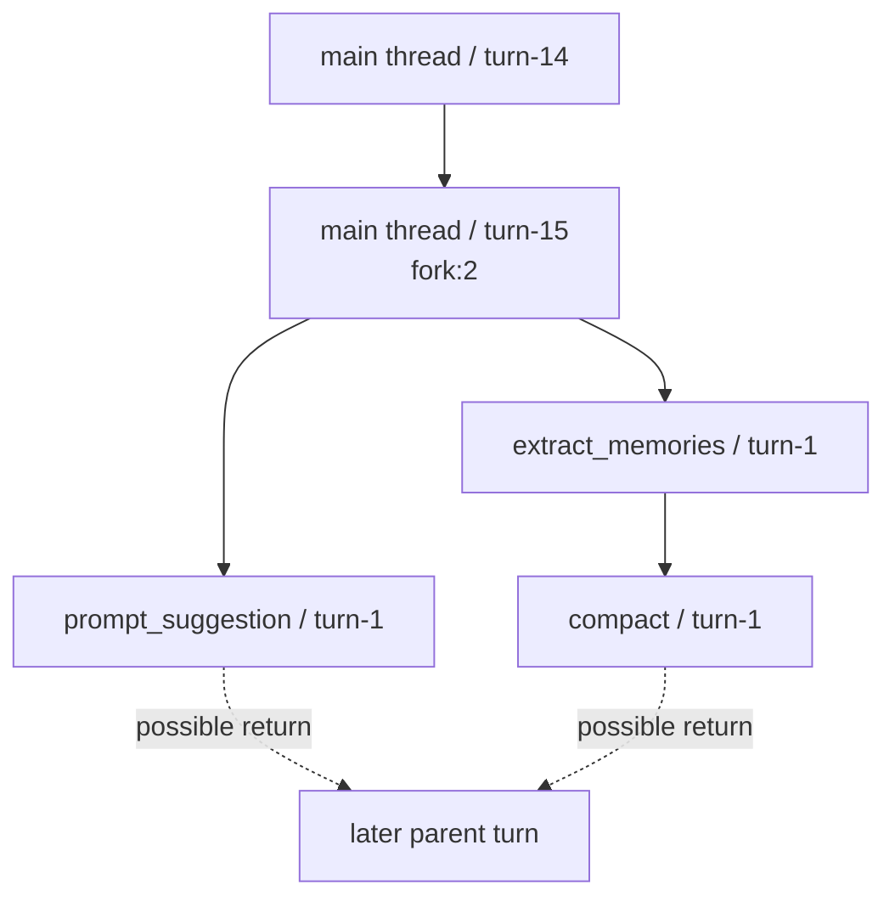

# Semantic Viewer Notes

This directory now contains an interactive local viewer for single `user_action` debugging, in addition to the existing Markdown, Mermaid, and CSV outputs.

## Entry Points

- Shared entry: `semantic_viewer_app.html`
- Complex sample: `user_action_semantic_complex/semantic_viewer.html`
- Simple sample: `user_action_semantic_simple/semantic_viewer.html`

## What Changed In This Round

The semantic viewer was upgraded from a static per-query lane view into a more debugger-like action viewer:

- Main thread stays centered and flows downward in time.
- Background queries fork out to both sides instead of looking like serial piles.
- Child-query follow-up work can render as a `return` edge back to a later parent turn when the timeline supports that claim.
- Clicking a fork source enables branch focus, dimming unrelated nodes and edges.
- The shared directory page keeps the action-id search on the left and uses a larger viewer pane on the right.
- Query lanes and nodes now use distinct colors.
- Dialogue cards now color-code `user`, `assistant`, `tool_result`, and `assistant tool use`.
- Long node text now wraps safely instead of overflowing.

## Recommended Reading Path

1. Open `semantic_viewer_app.html`.
2. Search for an action id such as `c6602631`.
3. Start from the centered `repl_main_thread`.
4. Click fork-source nodes with `fork:N` badges to inspect branch focus.
5. Open the `Dialogue` tab for a node to inspect faithful message blocks.

## Panel Walkthrough

The viewer is easiest to read as `search -> graph -> drawer`.

Panel layout sketch:

```text
+----------------------+--------------------------------------------------------------+
| Search               | Graph Canvas                                                 |
|----------------------|--------------------------------------------------------------|
| action id input      | centered main thread                                         |
| match list           | background queries branching left and right                  |
|                      | click node => drawer opens on the right                      |
|                      | Overview | Dialogue | Tools | Artifacts | Evidence | Risk    |
+----------------------+--------------------------------------------------------------+
```

What to do first:

1. Search an action id.
2. Follow the centered main thread from top to bottom.
3. When you see `fork:N`, treat that node as a branch start.
4. Click that node to enter branch focus.
5. Click a child node and read the `Dialogue` tab before the other tabs.
6. Use `Evidence` when you need to verify where a message block came from.

Branch sketch:



## How To Read Dialogue

Read `Dialogue` from top to bottom, but do **not** assume it is a simple human chat transcript.

The viewer shows a node-local message sequence. A node may include:

- `Assistant (carried into this turn)`: prior assistant context brought into the current turn
- `User`: the actual user message, or the task prompt sent into a child query
- `Tool result`: the observed result returned by a prior tool call
- `Assistant`: content generated in the current turn
- `Assistant tool use`: tool-use blocks emitted by the assistant

This means a node can legitimately contain several assistant-prefixed blocks in a row. That usually indicates context carry-forward, not several new assistant replies.

## Example Node Walkthrough

Action: `c6602631-d9df-48ae-9288-247151651ab2`

Node:

- `3032e0f1-0861-430c-9307-d8d8d75bcd86 / turn-1`
- Query source: `prompt_suggestion`

What this node means:

1. The parent thread has just finished a `push`.
2. That recent push context is carried into the child query as background evidence.
3. The child query receives a `SUGGESTION MODE` prompt asking it to predict the user's likely next input.
4. The child query outputs a suggested next user message.

Panel excerpt:

```text
Assistant (carried into this turn)
Pull --rebase succeeded. Now we can push.

Assistant (carried into this turn)
Bash
{
  "command": "cd \"E:/claude-code-transparent\" && git push origin main",
  "description": "Push to origin after rebase",
  "timeout": 60000
}

Tool result
To github.com:Bob10492/claude-code-transparent.git
   bcdd400..3d422c0  main -> main

User
[SUGGESTION MODE: Suggest what the user might naturally type next into Claude Code.]

Assistant
[Suggested next user input in Chinese; open the live viewer Dialogue tab for the exact faithful text.]
```

Interpretation:

- The first few assistant blocks are carried context from the parent thread.
- The `User` block is not a new human message; it is the internal prompt for the `prompt_suggestion` child query.
- The final `Assistant` block is the actual output of that child query.

## Graph Behaviors Added

- `fork` edges: branch from parent turn to child query
- `return` edges: return from child query to a later parent turn when a real later parent turn exists
- `fork:N` badge: marks branch-source nodes
- branch focus: click a fork-source node, then use `Clear Focus` to reset

## Validation

Commands used for this round:

```powershell
bun test tests/integration/semantic-dialogue-viewer.test.ts
bun run scripts/observability/deep_explain_action.ts --user-action-id c6602631-d9df-48ae-9288-247151651ab2 --selected-by explicit_user_action_id --output-dir ObservrityTask/action-reports/deep/user_action_semantic_complex
bun run scripts/observability/deep_explain_action.ts --latest --output-dir ObservrityTask/action-reports/deep/user_action_semantic_simple
```

## Current Limits

- `return` edges are only rendered when the child query finishes and the parent query has a real later turn to connect back to.
- Some actions naturally have no `return` edge because the parent thread does not continue after the child query completes.
- Screenshot assets were not added in this round because no stable local browser screenshot command was available in the current sandbox. The README uses faithful panel excerpts instead.
