# CC 可观测系统

<p align="center">
  <strong>把 Claude Code 的一次动作，变成可回放、可解释、可评测、可改进的事实链。</strong>
</p>

<p align="center">
  <a href="https://github.com/claude-code-best/claude-code"></a>
  
  
  
  
</p>

> 本项目来自原始 CCB 项目：[claude-code-best/claude-code](https://github.com/claude-code-best/claude-code)。
>
> 当前 README 聚焦本仓库在 **本地可观测、单 action 深度解释、实验评测、反馈闭环** 方向上的整体演进，不再复述原 CCB 的完整功能清单。

---

## 一句话介绍

**CC 可观测系统** 是一套围绕 Claude Code / CCB 改造出来的本地优先 Agent 调试与评测系统。

它的目标不是只记录日志，也不是只展示 dashboard，而是把一次真实用户动作变成一条可追溯的工程事实链：

```text
user input
-> query loop
-> tool call
-> subagent
-> snapshot evidence
-> user_action_id deep explain
-> run / score / compare
-> batch robustness
-> long-context evaluation
-> feedback proposal
```

这套系统最终回答四类问题：

1. **发生了什么？** 一次 `user_action_id` 下到底展开出哪些 query、turn、tool、subagent 和 snapshot？
2. **为什么这样发生？** 某个 subagent 为什么被拉起？某个 turn 为什么继续？某个工具调用为什么出现？
3. **代价是多少？** token、缓存、延迟、工具调用、子链路放大分别消耗在哪里？
4. **下一步该怎么改？** baseline 和 candidate 的差异是否真实、稳定、可解释？评测结果能否生成可审批的下一步 proposal？

---

## 系统全景图

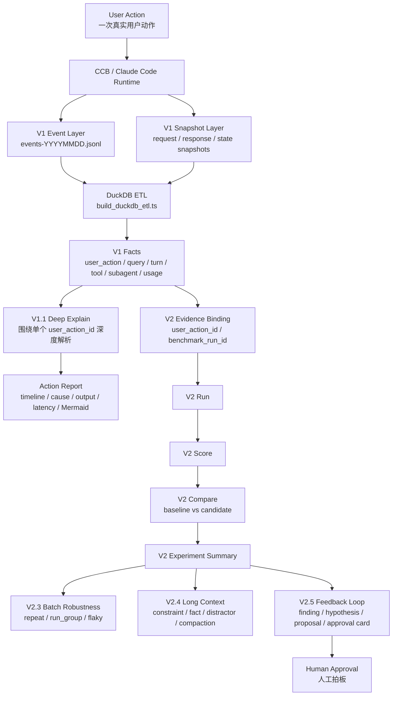

---

## 版本路线

| 阶段 | 一句话定位 | 解决的核心问题 | 主要产物 |
|---|---|---|---|
| **V1** | 本地事实观测系统 | 能不能把一次运行完整记录下来？ | JSONL events、snapshots、DuckDB、事实表、指标视图 |
| **V1.1 Deep Explain** | 单个 `user_action_id` 深度解析层 | 能不能把某一次 action 的全过程、原因、输出、延迟讲清楚？ | action 深度报告、时序表、分叉原因、复杂 Mermaid、阅读 SOP |
| **V2.1** | `bind_existing` 评测入口 | 能不能把已有 user_action_id 绑定成正式 run？ | run / score / compare / report |
| **V2.2-alpha** | `execute_harness` 自动执行 | 能不能自动跑 scenario 并捕获 action？ | benchmark_run_id、自动 capture |
| **V2.2-beta / V2.2.5** | 真实实验闭环 | candidate 是否真的带来 runtime difference？ | real experiment summary、manual fallback |
| **V2.3** | Batch + Robustness | 多任务、多候选、多次重复是否稳定？ | run_group、stability summary、flaky status、batch report |
| **V2.4** | Long Context 专项 | 长上下文下是否保持约束、事实和治理效果？ | context.* score、long_context_summary、manual review notes |
| **V2.5** | Feedback Loop Beta | 实验结果如何变成下一步建议？ | finding、hypothesis、proposal queue、approval card |

> **V1.1 Deep Explain 的位置**：它属于 `ObservrityTask/10-系统版本/v1` 体系中的深度解析内容，不是和 V1 平行的另一个底层采集系统。V1 负责“把事实采下来”，V1.1 负责“围绕一个具体 `user_action_id` 把事实讲清楚”。

---

## 为什么要做这套系统？

传统调试方式通常只能看到最终回答，真正困难的 Agent 过程隐藏在中间：

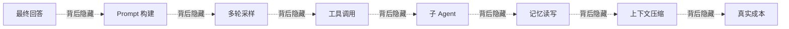

这套系统把隐藏过程变成证据：

- 一个 `user_action_id` 下有哪些主链和子链？
- 哪个 subagent 被启动，启动原因是什么？
- tool call 是否完整闭合？
- prompt input 里 raw、cache read、cache create 各占多少？
- 成本是主线程造成的，还是记忆链路放大的？
- 一次 action 的关键步骤、输出、耗时、分叉点是什么？
- candidate 看起来更好，是偶然，还是 repeat 后仍然稳定？
- 长上下文任务里有没有丢硬约束、关键事实或被干扰项带偏？
- 评测结果能不能沉淀成下一轮改动建议？

---

## 快速开始

### 环境要求

- **Bun**：建议使用最新版本
- **Windows + PowerShell**：当前观测脚本主要按 Windows PowerShell 工作流编写
- **DuckDB**：无需额外安装，仓库内已包含本地可执行文件路径设计

安装依赖：

```bash
bun install
```

启动开发模式：

```bash
bun run dev
```

构建：

```bash
bun run build
```

类型检查：

```bash
bun run typecheck
```

---

## V1：本地可观测事实层

V1 是整个系统的事实地基。它把运行时事件和大对象快照写入本地：

```text
.observability/
├─ events-YYYYMMDD.jsonl
├─ snapshots/
│  ├─ request-*.json
│  ├─ response-*.json
│  └─ state-*.json
└─ observability_v1.duckdb
```

### V1 核心对象

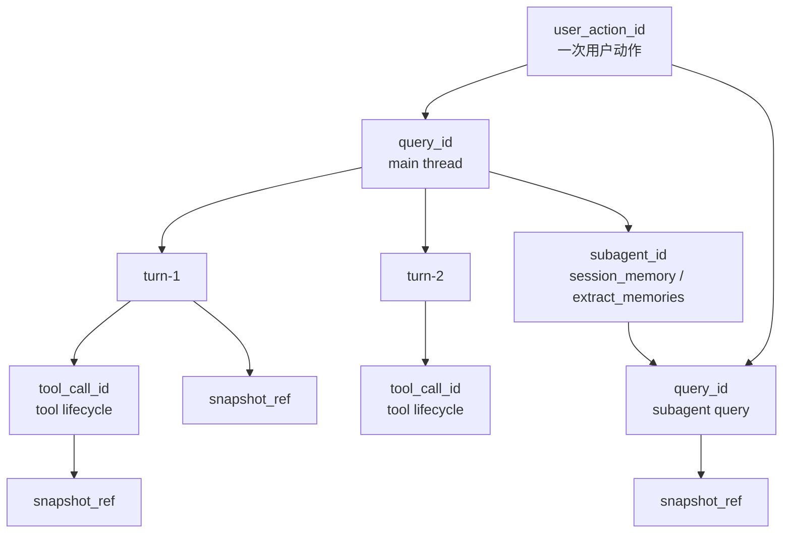

### V1 能看什么？

| 层级 | 可观测内容 | 典型问题 |
|---|---|---|
| Action | `user_action_id`、开始结束、总成本、总耗时 | 一次用户动作整体发生了什么？ |
| Query | 主线程 / 子线程 query、source、状态 | 这次动作分裂成了几条链？ |
| Turn | loop 次数、before/after snapshot、终态 | agent 绕了几轮？ |
| Tool | detected / enqueued / started / completed | 工具是否悬空或失败？ |
| Subagent | spawned / completed、reason、trigger kind | 为什么开了这个子 agent？ |
| Usage | raw input、cache read、cache create、output | token 真正花在哪里？ |
| Snapshot | request / response / state sidecar | 证据文件是否完整？ |

### V1 观测流程

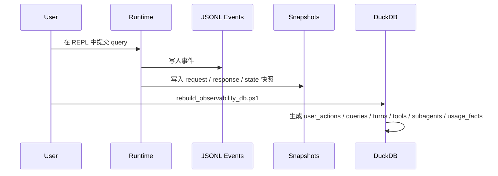

---

## V1.1 Deep Explain：单个 user_action_id 的深度解析

V1.1 Deep Explain 是本 README 的重点能力之一。它对应你本地：

```text
E:\claude-code\ObservrityTask\10-系统版本\v1
```

中“围绕一个 `user_action_id` 做深度解析”的内容。

它不是再加一层底层埋点，而是把 V1 采集到的事实，围绕一个具体 action id 组织成**可读、可讲、可复盘、可画图**的项目级解释能力。

### V1 与 V1.1 的关系

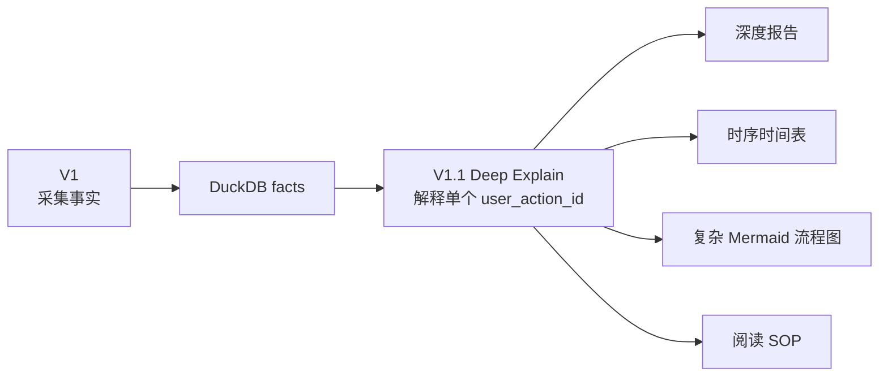

| 层级 | 关注点 | 输出 |
|---|---|---|
| **V1** | 事件、快照、DuckDB、事实表、指标口径 | 可查询、可重建、可审计的本地事实源 |
| **V1.1 Deep Explain** | 单个 action 的过程还原、原因解释、输出摘要、延迟标注、复杂流程图 | 一份能讲清楚“这次为什么这样跑”的深度报告 |

### V1.1 要回答的问题

- 这个 `user_action_id` 从哪条主线程 query 开始？
- 它展开出了哪些子 query？
- 哪些 subagent 被启动，启动原因是什么？
- 每个 turn 发生了什么，为什么进入下一轮？
- 每个 tool call 的输入、输出、耗时、状态是什么？
- 哪些 snapshot 是关键证据？
- 每一步大概输出了什么？
- 每一步大概耗时多久？
- 整条链路里哪里是主路径，哪里是后台路径？
- Mermaid 图应该如何画，才能让人一眼看懂复杂分叉？

### V1.1 Deep Explain 流程

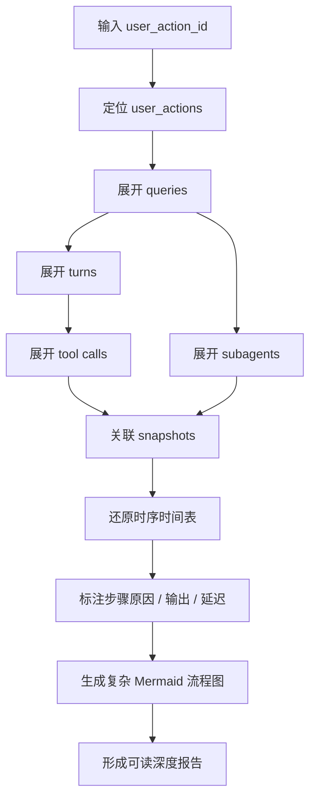

### 如何生成 V1.1 深度报告

先重建本地观测库：

```powershell
powershell -ExecutionPolicy Bypass -File .\scripts\observability\rebuild_observability_db.ps1
```

查看最近 action：

```powershell
.\tools\duckdb\duckdb.exe -json .\.observability\observability_v1.duckdb "select user_action_id, started_at, duration_ms, query_count, subagent_count, total_prompt_input_tokens, total_billed_tokens from user_actions order by started_at_ms desc limit 10;"
```

解析指定 action：

```powershell
powershell -ExecutionPolicy Bypass -File .\scripts\observability\explain_action.ps1 -UserActionId <user_action_id>
```

解析最近一次 action：

```powershell
powershell -ExecutionPolicy Bypass -File .\scripts\observability\explain_action.ps1 -Latest
```

查看时间线：

```powershell
powershell -ExecutionPolicy Bypass -File .\scripts\observability\read_timeline.ps1 -UserActionId <user_action_id>
```

### V1.1 报告结构

```text
Action Basics
├─ user_action_id
├─ started_at / duration
├─ query_count / turn_count / tool_count / subagent_count
└─ token usage summary

Execution Timeline
├─ main thread started
├─ prompt built
├─ assistant sampled
├─ tool detected / executed
├─ subagent spawned
├─ subagent completed
└─ query terminated

Causal Branch Points
├─ post_sampling_hook / token_threshold_and_tool_threshold
├─ post_sampling_hook / token_threshold_and_natural_break
└─ stop_hook_background / post_turn_background_extraction

Mermaid Flowchart
└─ 主链路 + 子链路 + 工具 + snapshot 证据

Reading SOP
└─ 如何从报告反向定位原始事件和 snapshot
```

### V1.1 示例流程图

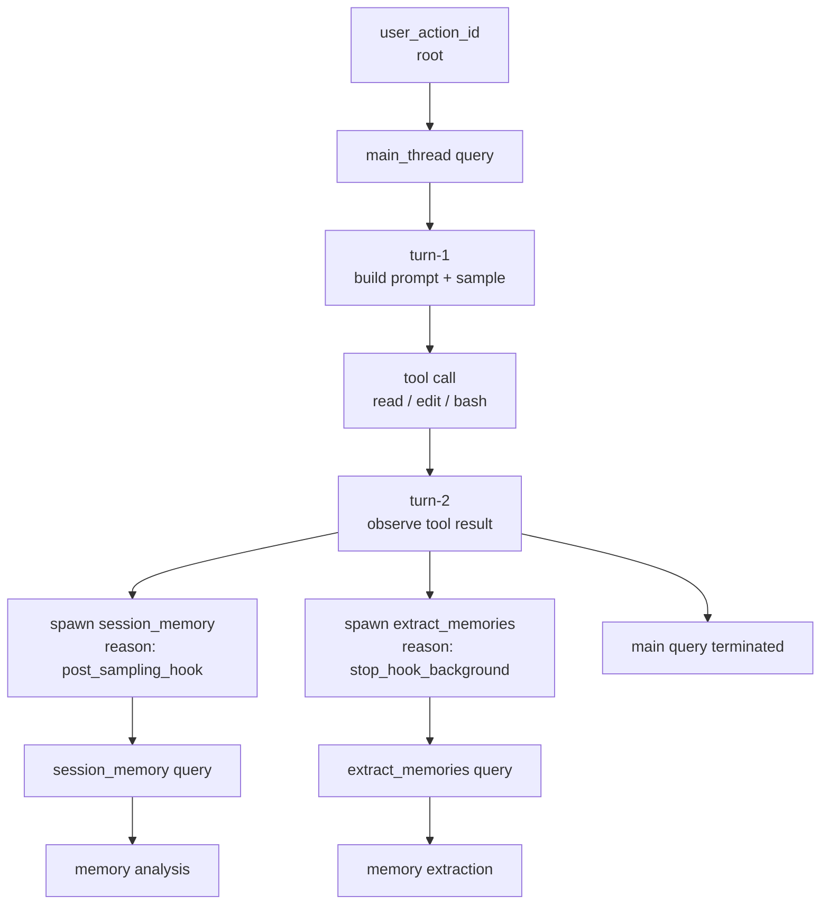

---

## V1 成本模型

不要只看 `input_tokens`。V1 的成本模型按下面口径拆分：

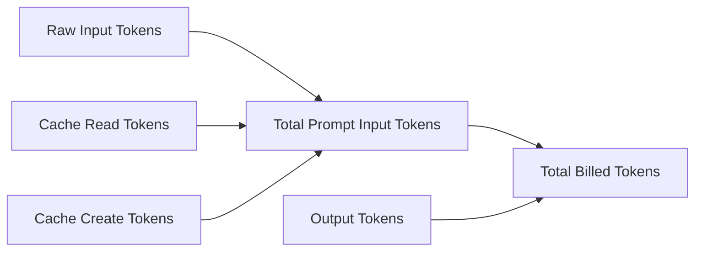

| 指标 | 含义 |
|---|---|
| `raw_input_tokens` | 本次请求真正新增的裸输入 |
| `cache_read_input_tokens` | 从缓存读取的上下文 |
| `cache_create_input_tokens` | 新建缓存所需的输入 |
| `total_prompt_input_tokens` | prompt 输入总量 |
| `output_tokens` | 模型输出 |
| `total_billed_tokens` | 估算总计费 token |
| `subagent_amplification_ratio` | 子链路成本相对主线程的放大倍数 |

这让你可以区分：

- 是用户输入本身太长？
- 是历史上下文太重？
- 是 session memory 太贵？
- 是 extract memories 在后台放大成本？
- 是 candidate 真省钱，还是只是少跑了一段链路？

---

## V2：本地评测系统

V2 不替代 V1 / V1.1，而是建立在它们之上：

- V1 提供事实。
- V1.1 帮你读懂单次 action。
- V2 把事实绑定成实验，比较 baseline 和 candidate。

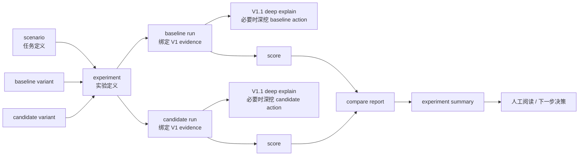

### V2 对象模型

| 对象 | 作用 | 目录 |
|---|---|---|
| `scenario` | 定义评测任务 | `tests/evals/v2/scenarios/` |
| `variant` | 定义 baseline / candidate 配置 | `tests/evals/v2/variants/` |
| `experiment` | 组合 scenario 与 variant | `tests/evals/v2/experiments/` |
| `run` | 一次 scenario + variant 的事实记录 | `tests/evals/v2/runs/` |
| `score` | run 上的评分结果 | `tests/evals/v2/scores/` |
| `run_group` | 多次 repeat 的聚合单元 | `tests/evals/v2/run-groups/` |
| `experiment summary` | 实验级 JSON 总结 | `tests/evals/v2/experiment-runs/` |
| `batch report` | 人类可读 Markdown 报告 | `ObservrityTask/10-系统版本/v2/06-运行报告/` |
| `feedback run` | V2.5 反馈闭环产物 | `tests/evals/v2/feedback/` |

---

## V2.2.5：真实实验闭环

V2.2.5 的价值是让系统同时具备两条可用路径：

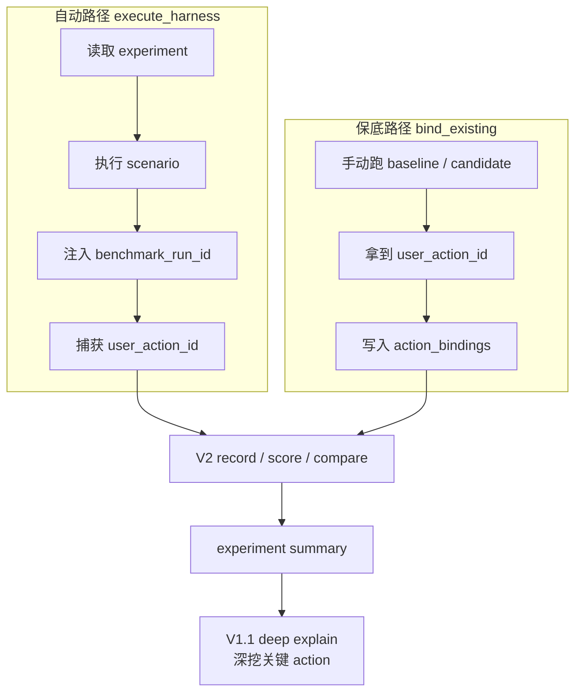

运行自动真实实验：

```powershell
bun run scripts/evals/v2_validate_manifests.ts
bun run scripts/evals/v2_run_experiment.ts --experiment tests/evals/v2/experiments/session_memory_runtime_sparse_vs_default.json
```

运行手动 fallback：

```powershell
.\scripts\evals\v2_manual_real_run.ps1 -ScenarioId "session_memory_trigger_sensitive" -VariantId "baseline_default" -ExperimentId "session_memory_runtime_sparse_vs_default_manual" -MaxTurns 12

.\scripts\evals\v2_manual_real_run.ps1 -ScenarioId "session_memory_trigger_sensitive" -VariantId "candidate_session_memory_sparse" -ExperimentId "session_memory_runtime_sparse_vs_default_manual" -MaxTurns 12

bun run scripts/evals/v2_run_experiment.ts --experiment tests/evals/v2/experiments/session_memory_runtime_sparse_vs_default_manual.bind_existing.json
```

---

## V2.3：Batch + Robustness

V2.3 解决的问题是：**一次实验结果是否稳定？**

它支持多 scenario、多 candidate、多次 repeat、run_group 聚合、stability summary、flaky status 和 batch markdown report。

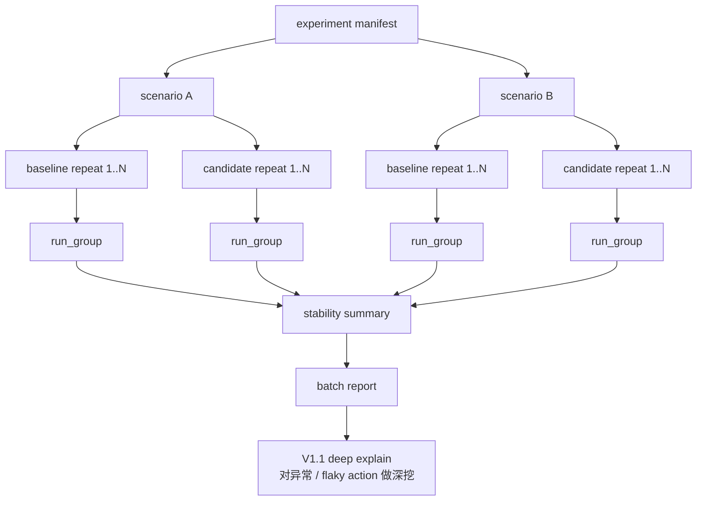

运行 V2.3 无成本 smoke：

```powershell
bun run scripts/evals/v2_run_experiment.ts --experiment tests/evals/v2/experiments/_experiment.robustness.smoke.json
```

重点看：

- `repeat_success_rate`
- `capture_failure_rate`
- `total_billed_tokens_stddev`
- `tool_call_count_variance`
- `subagent_count_variance`
- `turn_count_variance`
- `flaky_status`

---

## V2.4：Long Context 专项

V2.4 让系统开始系统地问：

> 上下文变长之后，这个 harness 到底有没有稳住约束、事实和治理效果？

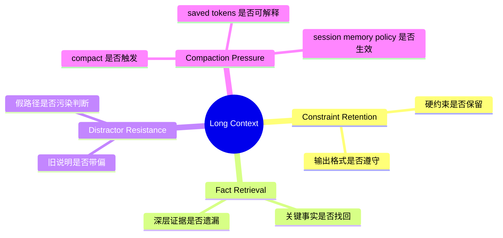

V2.4 新增的典型指标：

| 指标 | 含义 |
|---|---|
| `context.retained_constraint_count` | 保留下来的约束数量 |
| `context.lost_constraint_count` | 丢失的约束数量 |
| `context.constraint_retention_rate` | 约束保持率 |
| `context.retrieved_fact_hit_rate` | 关键事实命中率 |
| `context.distractor_confusion_count` | 被干扰信息带偏次数 |
| `context.compaction_trigger_count` | compact 触发次数 |
| `context.compaction_saved_tokens` | compact 节省 token |
| `context.manual_review_required` | 是否需要人工复核 |

运行 fixture smoke：

```powershell
bun run scripts/evals/v2_run_experiment.ts --experiment tests/evals/v2/experiments/_experiment.long_context.fixture_smoke.json
```

运行小型真实链路 smoke：

```powershell
bun run scripts/evals/v2_run_experiment.ts --experiment tests/evals/v2/experiments/_experiment.long_context.real_smoke.json
```

验证长上下文 artifact：

```powershell
bun run scripts/evals/v2_verify_long_context.ts
```

---

## V2.5：Feedback Loop Beta

V2.5 的核心原则是：

> 自动提建议，不自动改代码。

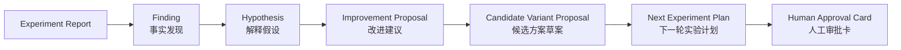

运行 feedback：

```powershell
bun run scripts/evals/v2_run_feedback.ts --experiment-run tests/evals/v2/experiment-runs/v2_4_long_context_real_smoke_2026-05-03T060617173Z.json
```

验证 feedback artifact：

```powershell
bun run scripts/evals/v2_validate_feedback_artifacts.ts
```

生成人工优先结论草稿：

```powershell
bun run scripts/evals/v2_create_manual_conclusion.ts --experiment-run tests/evals/v2/experiment-runs/v2_5_long_context_real_smoke_expectation_contract_v0_2026-05-03T153229792Z.json
```

---

## 推荐阅读路径

### 第一次看项目

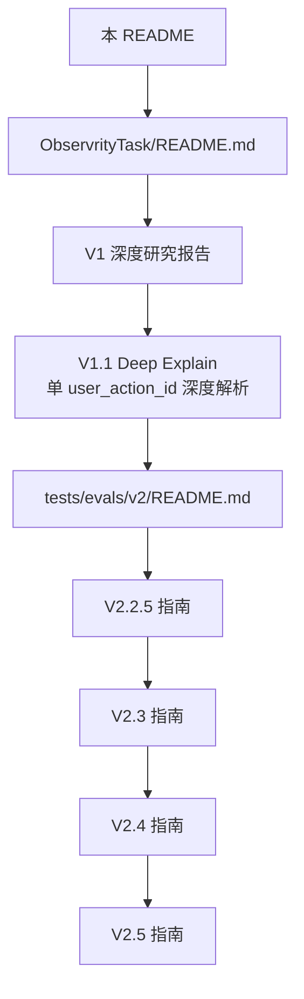

### 刚跑完一次 query

1. 运行 `rebuild_observability_db.ps1`
2. 运行 `explain_action.ps1 -Latest`
3. 看 action report 里的 Mermaid DAG
4. 看 query / subagent / tool / usage
5. 如果要进入评测，再把 `user_action_id` 绑定到 V2 run

### 深挖一个 user_action_id

1. 从 `user_actions` 表定位目标 action
2. 用 `queries` 看主链和子链
3. 用 `turns` 看 loop 结构
4. 用 `tools` 看工具生命周期
5. 用 `subagents` 看后台分叉原因
6. 用 `events_raw + snapshots` 回到原始证据
7. 用 `explain_action.ps1` 收敛成报告和 Mermaid
8. 把报告沉淀到 `ObservrityTask/10-系统版本/v1` 的深度解析内容中

### 判断 candidate 是否值得继续

1. 先看 `experiment_validity`
2. 再看 `runtime_difference_summary`
3. 再看 `scorecard_summary`
4. 再看 `risk_verdict`
5. 如果是 V2.3+，必须看 `run_group` 与 `flaky_status`
6. 如果出现异常或 flaky，用 V1.1 deep explain 深挖对应 `user_action_id`
7. 如果是 V2.4+，继续看 `long_context_summary`
8. 如果是 V2.5+，最后看 `approval card`

---

## 常用命令总表

### 项目基础命令

```bash
bun install
bun run dev
bun run build
bun run typecheck
bun test
```

### V1 / V1.1 观测与深度解析

```powershell
powershell -ExecutionPolicy Bypass -File .\scripts\observability\rebuild_observability_db.ps1

powershell -ExecutionPolicy Bypass -File .\scripts\observability\daily_summary.ps1

powershell -ExecutionPolicy Bypass -File .\scripts\observability\build_dashboard.ps1

powershell -ExecutionPolicy Bypass -File .\scripts\observability\explain_action.ps1 -Latest

powershell -ExecutionPolicy Bypass -File .\scripts\observability\explain_action.ps1 -UserActionId <user_action_id>

powershell -ExecutionPolicy Bypass -File .\scripts\observability\read_timeline.ps1 -UserActionId <user_action_id>
```

### V2 验证命令

```powershell
bun run scripts/evals/v2_validate_manifests.ts
bun run scripts/evals/v2_validate_experiment_artifacts.ts
bun run scripts/evals/v2_verify_bind_runner.ts
bun run scripts/evals/v2_verify_execute_harness_alpha.ts
bun run scripts/evals/v2_verify_long_context.ts
bun run scripts/evals/v2_validate_feedback_artifacts.ts
```

### V2 实验命令

```powershell
# V2.2 execute_harness smoke
bun run scripts/evals/v2_run_experiment.ts --experiment tests/evals/v2/experiments/_experiment.execute_harness.smoke.json

# V2.2.5 real experiment
bun run scripts/evals/v2_run_experiment.ts --experiment tests/evals/v2/experiments/session_memory_runtime_sparse_vs_default.json

# V2.3 robustness smoke
bun run scripts/evals/v2_run_experiment.ts --experiment tests/evals/v2/experiments/_experiment.robustness.smoke.json

# V2.4 long-context fixture smoke
bun run scripts/evals/v2_run_experiment.ts --experiment tests/evals/v2/experiments/_experiment.long_context.fixture_smoke.json

# V2.4 long-context real smoke
bun run scripts/evals/v2_run_experiment.ts --experiment tests/evals/v2/experiments/_experiment.long_context.real_smoke.json

# V2.5 expectation-contract follow-up
bun run scripts/evals/v2_run_experiment.ts --experiment tests/evals/v2/experiments/_experiment.long_context.real_smoke.expectation_contract_v0.json
```

### V2.5 Feedback 命令

```powershell
bun run scripts/evals/v2_run_feedback.ts --experiment-run <experiment-run-json>

bun run scripts/evals/v2_create_manual_conclusion.ts --experiment-run <experiment-run-json>
```

---

## 目录地图

```text
.
├─ src/
│  └─ observability/
│     └─ v2/
│        ├─ evalTypes.ts
│        └─ evalExperimentTypes.ts
│
├─ scripts/
│  ├─ observability/
│  │  ├─ build_duckdb_etl.ts
│  │  ├─ rebuild_observability_db.ps1
│  │  ├─ daily_summary.ps1
│  │  ├─ build_dashboard.ps1
│  │  ├─ read_timeline.ps1
│  │  └─ explain_action.ps1
│  │
│  └─ evals/
│     ├─ v2_run_experiment.ts
│     ├─ v2_harness_execution.ts
│     ├─ v2_record_run.ts
│     ├─ v2_compare_runs.ts
│     ├─ v2_score_registry.ts
│     ├─ v2_run_feedback.ts
│     └─ v2_create_manual_conclusion.ts
│
├─ tests/
│  └─ evals/
│     └─ v2/
│        ├─ scenarios/
│        ├─ fixtures/
│        ├─ variants/
│        ├─ experiments/
│        ├─ score-specs/
│        ├─ runs/
│        ├─ scores/
│        ├─ run-groups/
│        ├─ experiment-runs/
│        └─ feedback/
│
├─ ObservrityTask/
│  ├─ README.md
│  └─ 10-系统版本/
│     ├─ v1/
│     │  ├─ 01-总览/
│     │  ├─ 04-专题研究/
│     │  └─ V1.1 Deep Explain：单个 user_action_id 深度解析相关内容
│     └─ v2/
│        ├─ 01-总览/
│        ├─ 02-实施任务书/
│        ├─ 06-运行报告/
│        └─ 07-反馈报告/
│
└─ .observability/
   ├─ events-YYYYMMDD.jsonl
   ├─ snapshots/
   └─ observability_v1.duckdb
```

---

## 典型工作流

### 工作流 A：调试一次真实用户动作

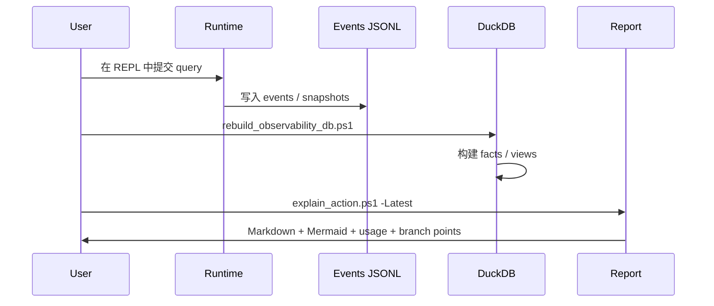

### 工作流 B：深度解析一个 user_action_id

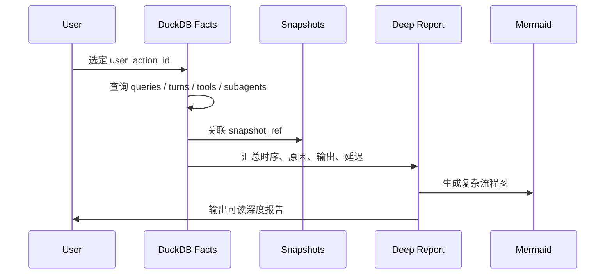

### 工作流 C：比较 baseline 与 candidate

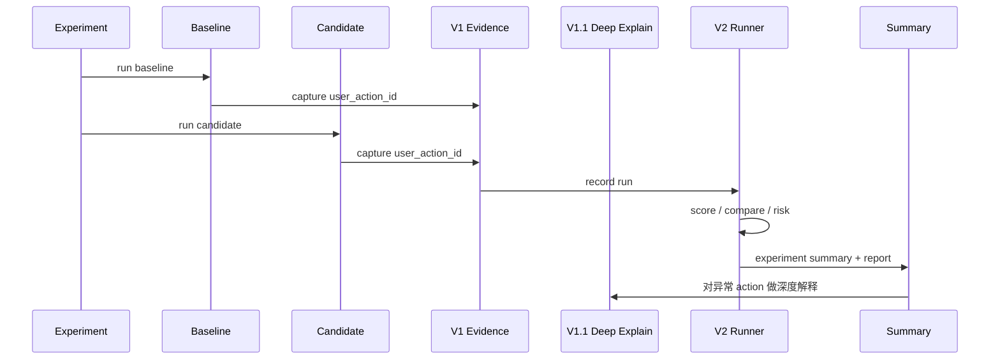

### 工作流 D：从实验结果生成下一步建议

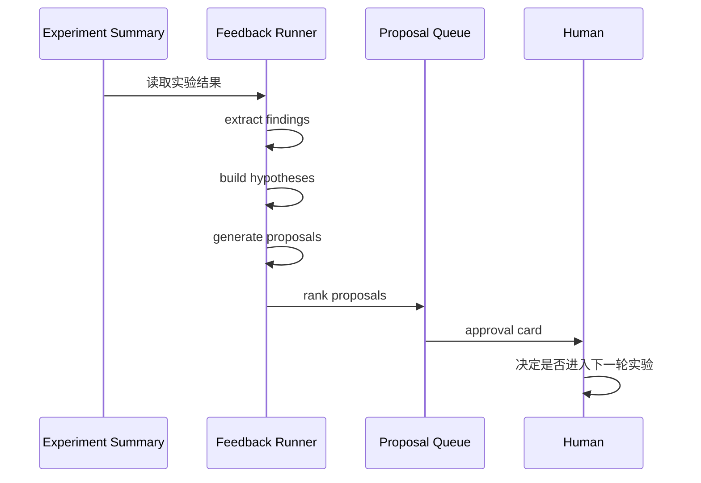

---

## 设计原则

### 1. 本地优先

所有核心事实都落在本地：JSONL、snapshot sidecar、DuckDB、Markdown report、experiment artifact。

### 2. 事实先于结论

V2 不直接“相信模型说法”，而是先绑定 V1 的事实证据，再产生 run / score / compare。

```text
No evidence -> no score.
No binding -> no experiment.
No repeat -> no stability claim.
No manual review -> no semantic final verdict.
```

### 3. Deep Explain 必须可还原

V1.1 的重点不是写漂亮总结，而是从一个 `user_action_id` 出发，能够回到原始事件、snapshot、DuckDB 表和每个分叉点原因。

### 4. 自动化不越权

V2.5 可以生成建议，但不自动改代码、不自动 promote candidate、不自动合并结论。

### 5. 不把单次成功误认为稳定规律

V2.3 之后，真正有价值的问题不再是“这一次好不好”，而是多次 repeat 后是否仍然稳定。

### 6. 长上下文必须保留人工复核

V2.4 承认长上下文质量不是一个 token 数或单分数能完全裁决的，因此保留 `manual_review_required` 是设计的一部分，而不是缺陷。

---

## 当前边界

这套系统已经能做很多事情，但仍然有明确边界：

- 不是线上 APM 平台
- 不是分布式 trace 基础设施
- 不保证跨平台脚本都已完善
- 不自动证明 candidate 全局更优
- 不自动替代人工评审
- 不应该把 fixture smoke 当成真实模型收益结论
- 不应该把 feedback proposal 当成最终决策

---

## 适合谁使用？

- 想研究 Claude Code / CCB agent loop 的开发者
- 想知道一次 query 背后实际发生了什么的人
- 想深度解析单个 `user_action_id` 的人
- 想调试 tool call、subagent、session memory、context compaction 的人
- 想把 agent 改动做成可复盘实验的人
- 想用本地证据链比较 baseline / candidate 的人
- 想搭建“评测 -> 反馈 -> 下一轮实验”闭环的人

---

## 贡献方向

| 方向 | 示例 |
|---|---|
| V1 观测增强 | 更低 orphan event rate、更强 snapshot 校验 |
| V1.1 Deep Explain | 更复杂 Mermaid、步骤原因、输出摘要、延迟标注 |
| V1 报告增强 | 更清晰的 action 阅读模板 |
| V2 score-spec | 更细的语义评分、更多 evidence requirement |
| V2.3 稳定性 | 更可靠的 flaky 判定、更好的 repeat 聚合 |
| V2.4 长上下文 | 更多 scenario family、更强 manual review contract |
| V2.5 feedback | 更严格 proposal taxonomy、更清晰 approval card |
| 跨平台体验 | Linux/macOS 脚本、路径自动发现 |
| 文档与示例 | 真实报告截图、最佳实践 cookbook |

---

## FAQ

### Q: 我只是想看最近一次 query 发生了什么，应该从哪里开始？

运行：

```powershell
powershell -ExecutionPolicy Bypass -File .\scripts\observability\rebuild_observability_db.ps1
powershell -ExecutionPolicy Bypass -File .\scripts\observability\explain_action.ps1 -Latest
```

然后先读生成的 action report。

### Q: V1 和 V1.1 Deep Explain 的区别是什么？

V1 解决“事实有没有被记录下来”。

V1.1 Deep Explain 解决“围绕一个具体 `user_action_id`，能不能把完整过程、原因、输出、延迟和 Mermaid 流程讲清楚”。

### Q: V1.1 在仓库哪里？

它对应 `ObservrityTask/10-系统版本/v1` 体系下关于单个 `user_action_id` 深度解析的内容。

### Q: V1 / V1.1 和 V2 的关系是什么？

V1 是事实观测系统，V1.1 是单 action 深度解释层，V2 是评测系统。V2 的 run 和 score 必须回到 V1 事实；遇到异常或 flaky 时，再用 V1.1 深挖具体 action。

### Q: 为什么不能只看 token 降低就说 candidate 更好？

因为 token 降低可能来自少跑链路、capture 失败、任务没完成、上下文丢失或语义质量下降。必须同时看 `experiment_validity`、`runtime_difference_summary`、`scorecard_summary`、`risk_verdict` 和必要的人工复核。

### Q: fixture smoke 能证明真实效果吗？

不能。fixture smoke 主要证明 runner、schema、report、artifact 管线是通的。真实收益仍然需要 real experiment 或 real smoke 证明。

### Q: V2.5 会自动改代码吗？

不会。V2.5 当前是 feedback loop beta：自动生成建议，不自动改代码，不自动合并，不绕过人工审批。

---

## 来源说明

本项目来自原始 CCB 项目：

- Upstream: [https://github.com/claude-code-best/claude-code](https://github.com/claude-code-best/claude-code)

当前仓库在此基础上加入并整理了本地可观测、V1.1 Deep Explain、V2 评测、长上下文专项与反馈闭环相关内容。

---

## License / 声明

本项目仅供学习、研究与工程实验使用。

原始 Claude Code 相关权利归其各自权利方所有。

CCB 原始项目来源见：[claude-code-best/claude-code](https://github.com/claude-code-best/claude-code)。
