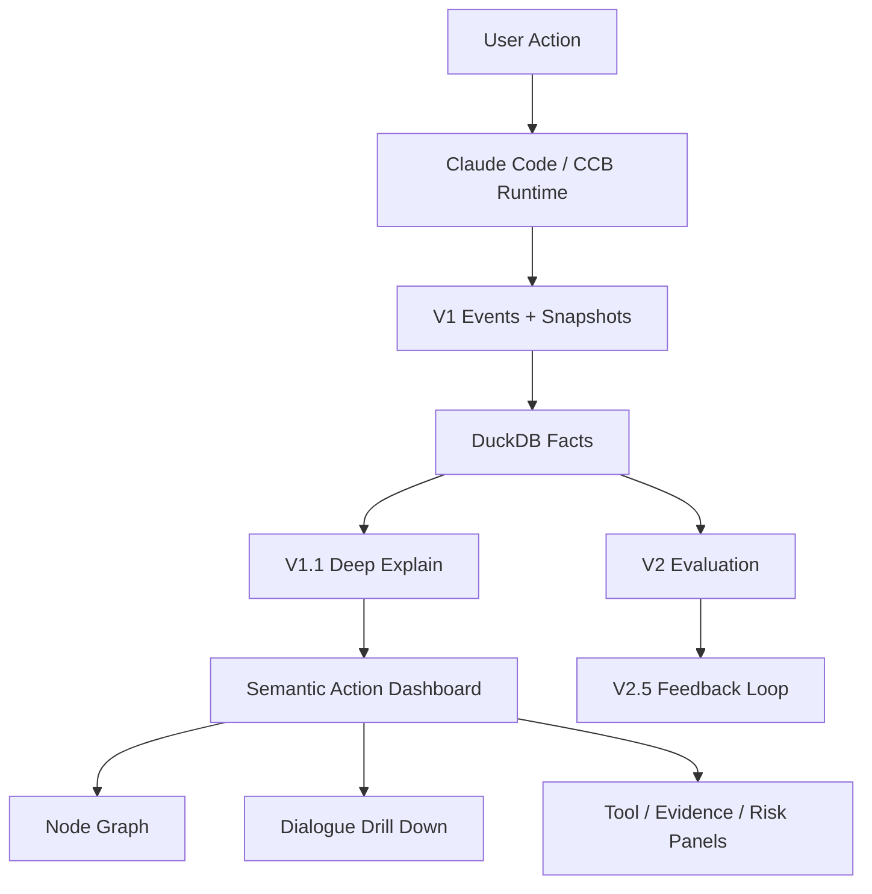

# CC 可观测系统

<p align="center">
  <strong>把一次 Claude Code / CCB user action 变成可回放、可搜索、可下钻、可审计的本地调试面板。</strong>
</p>

<p align="center">
  <a href="https://github.com/claude-code-best/claude-code"></a>
  
  
  
  
</p>

> 本仓库来自原始 CCB 项目：[claude-code-best/claude-code](https://github.com/claude-code-best/claude-code)。  
> 当前重点不是复述上游全部功能，而是把本地 observability、单 action 深解释、节点图、对话回放、证据链和本地 dashboard 做成一套可操作的 Agent 调试系统。

## 核心成果：本地 Semantic Action Dashboard

这个项目现在最值得看的部分，是一个本地运行的语义化 action viewer。它不是把原始 API payload 直接扔出来，也不是只画一张静态 Mermaid 图，而是把一次真实 `user_action_id` 还原成一张可以交互阅读的执行流程图。

你可以在本地 dashboard 中完成这些操作：

- 输入或搜索一个 `user_action_id`，打开对应 action。
- 看到主线程 `repl_main_thread` 在画布中央自上而下展开。
- 看到子 query、子 agent、compact、旁路循环从主线程两侧 fork 出去。
- 拖动画布、缩放画布、聚焦某个分支。
- 点击任意节点，在右侧详情抽屉下钻。
- 查看该节点附近的 `Overview`、`Dialogue`、`Tools`、`Evidence`、`Risk`。
- 用不同颜色区分不同 query / agent 的节点。
- 用不同颜色区分 `user`、`assistant`、`tool result`、`assistant tool use` 对话块。
- 看到子 agent 结果回流父线程时的 return edge。
- 在 dashboard 内刷新 DuckDB，并为最新 action 一键生成 viewer。

<p align="center">
  
</p>

## 它解决的问题

长任务调试时，只知道“最后成功/失败”是不够的。真正难读的是中间过程：

- agent 有没有开子 agent？
- 子 agent 的目的是什么？
- 主线程和旁路线程的真实顺序是什么？
- 每个 turn 调用了哪些工具？
- 工具结果如何进入下一轮模型请求？
- 模型是否基于错误、过期或幻觉内容继续执行？
- 某个脚本、任务书、Excel 校验逻辑到底是在什么时候被写入或修改的？
- token、耗时、压缩、证据快照和风险信号分别在哪里？

Semantic Action Dashboard 的目标是让你像程序员看日志一样看 agent 运行过程，但阅读入口不是日志流，而是一张可以下钻的 DAG。

## Dashboard 怎么读

推荐阅读顺序：

1. 打开本地 dashboard。
2. 在左侧搜索框输入完整或唯一前缀 `user_action_id`。
3. 先看画布中间的 `repl_main_thread`，从上往下读主线。
4. 遇到 `fork:N` 或旁路线节点时，查看它从哪个父节点分叉。
5. 点击你关心的节点，打开右侧详情抽屉。
6. 优先读 `Dialogue`，确认用户、模型、工具结果在这个节点附近具体说了什么。
7. 再读 `Tools`，确认实际调用的工具、命令、文件路径和结果摘要。
8. 用 `Evidence` 回到 snapshot / tool result 证据。
9. 用 `Risk` 看 fallback、推断边界、未验证输出等风险信号。
10. 如果只想看某个分支，点击 fork 起点后使用 focus，再用 `Clear Focus` 恢复全图。

右侧抽屉中，`Dialogue` 是最关键的 tab。它遵循一个原则：不暴露固定系统提示词和全量 payload，但只要展示，就必须忠实于运行事实，不把模型没说过的话改写成“更好读”的总结。

<p align="center">
  
</p>

对话块含义：

- `User`: 主线程中通常是真实用户输入；子 query 中可能是内部任务提示。
- `Assistant`: 模型输出的文本内容。
- `Assistant context carried into this turn`: 被带入本 turn 请求窗口的历史 assistant 内容，不一定是本轮新生成。
- `Assistant tool use`: 模型决定调用工具时的工具名和输入。
- `Tool result`: 工具返回给模型的结果，会进入后续请求上下文。

## 本地服务使用方法

启动本地 dashboard：

```bash
bun run observability:viewer
```

默认打开：

```text
http://127.0.0.1:8765
```

左侧有两个最近 action 区域：

- `Recent 5 DB Actions`: 直接读取 `.observability/observability_v1.duckdb` 中最新的 `user_actions`。
- `Recent 5 User Actions`: 已经生成过 semantic viewer 的最新 action。

如果你今天刚跑了一个任务，但 dashboard 没看到：

1. 点击 `Refresh DB`，从本地 observability events 重建 DuckDB。
2. 看 `Recent 5 DB Actions` 是否出现今天的 action。
3. 如果出现但没有 viewer，点击该行 `Generate`。
4. 如果只想看最新 action，点击 `Generate Latest Viewer`。
5. 生成后点击 `Open`，或者在搜索框输入 action id。

常用服务路由：

| 路由 | 用途 |
| --- | --- |
| `/` | 可搜索 dashboard 首页 |
| `/api/actions` | 已生成 viewer 的 action 索引 |
| `/api/db-actions` | DuckDB 中最新 action |
| `/api/refresh-db` | 重建本地 DuckDB |
| `/api/generate-latest` | 为最新 DB action 生成 viewer |
| `/api/generate/<user_action_id>` | 为指定 action 生成 viewer |
| `/view/<user_action_id_or_prefix>` | 直接打开某个 viewer |
| `/data/<user_action_id_or_prefix>` | 查看该 action 的 viewer JSON 数据 |

如果要改端口或报告目录：

```bash
bun run observability:viewer -- --root ObservrityTask/action-reports/deep --host 127.0.0.1 --port 8765
```

## 安装方法

基础环境：

- Windows + PowerShell 是当前主要验证环境。
- Bun 用于运行 TypeScript 脚本和测试。
- 本地 DuckDB 文件位于 `.observability/observability_v1.duckdb`。
- 观测报告默认输出到 `ObservrityTask/action-reports/deep`。

安装依赖：

```bash
bun install
```

类型检查：

```bash
bun run typecheck
```

运行开发版 CLI：

```bash
bun run dev
```

运行本地观测 dashboard：

```bash
bun run observability:viewer
```

## 生成单 action viewer

显式指定 action id：

```bash
bun run scripts/observability/deep_explain_action.ts --user-action-id <USER_ACTION_ID>
```

使用最新 action：

```bash
bun run scripts/observability/deep_explain_action.ts --latest
```

如果你想先刷新数据库：

```powershell
powershell -ExecutionPolicy Bypass -File scripts\observability\rebuild_observability_db.ps1 -Quiet
```

如果你想直接查最近 action：

```powershell
.\tools\duckdb\duckdb.exe .observability\observability_v1.duckdb "select user_action_id, started_at, duration_ms, query_count, tool_call_count from user_actions order by started_at_ms desc limit 20;"
```

## 系统结构



V1.1 之后的核心链路：

1. Runtime 记录本地事件、turn、tool、snapshot。
2. ETL 把本地事件整理成 DuckDB facts。
3. `deep_explain_action.ts` 按 `user_action_id` 读取 action 事实。
4. phase / tool / artifact / evidence / repair chain 被组织为深解释数据。
5. 生成 CSV、Mermaid、Markdown deep report。
6. 生成 `semantic_viewer.html` 和 `semantic_viewer.data.json`。
7. 本地 dashboard 服务负责搜索、刷新 DB、生成 viewer、打开节点图。

## 关键能力

### 1. 单 action 深解释

围绕一个真实 `user_action_id` 展开：

- query / turn
- tool call
- subagent
- snapshot evidence
- token / duration / compression
- artifact
- repair chain
- semantic dialogue

入口代码：

- [scripts/observability/deep_explain_action.ts](scripts/observability/deep_explain_action.ts)
- [scripts/observability/lib/semantic_dialogue_viewer.ts](scripts/observability/lib/semantic_dialogue_viewer.ts)
- [scripts/observability/semantic_viewer_server.ts](scripts/observability/semantic_viewer_server.ts)

### 2. 任意维度下钻的交互式面板

每个节点都可以继续向下看：

- `Overview`: 节点身份、query、turn、耗时、工具数、风险摘要。
- `Dialogue`: 忠实展示该节点附近 user / assistant / tool result / tool use。
- `Tools`: 工具名、命令或路径、输入摘要、输出摘要、问题和修复信号。
- `Evidence`: 关键 snapshot 和 evidence ref。
- `Risk`: fallback、推断边界和潜在不可靠信号。

这让“流程图”和“聊天记录”不是两个割裂视图，而是同一个 action DAG 的不同阅读层级。

### 3. 本地优先、按需生成

dashboard 不要求远端后端。它直接服务本地文件和本地 DuckDB：

- 本地 HTTP 服务只绑定 `127.0.0.1`。
- 原始运行事实仍在本机。
- viewer 数据按 action 生成，不需要一次性加载全部历史。
- 最近 action 从 DuckDB 读取，viewer 缺失时再按需生成。

### 4. V2 评测与反馈闭环

V2 之后的内容已经打通，但不是 README 的主入口：

- `V2.1`: 绑定已有 action 进入评测。
- `V2.2`: 自动执行 harness 并捕获 action。
- `V2.3`: batch / robustness。
- `V2.4`: long-context 专项。
- `V2.5`: 把实验结果沉淀成 feedback proposal。

如果你第一次看这个仓库，建议先看 dashboard，再看 V2。

## 关键目录

| 路径 | 说明 |
| --- | --- |
| [scripts/observability](scripts/observability) | ETL、deep explain、viewer、dashboard server |
| [scripts/observability/lib](scripts/observability/lib) | phase、tool、artifact、evidence、semantic viewer 逻辑 |
| [ObservrityTask/action-reports/deep](ObservrityTask/action-reports/deep) | 已生成 viewer、样例报告、README |
| [docs/observability](docs/observability) | dashboard、action id、可读性方案文档 |
| [tests/integration/semantic-viewer-server.test.ts](tests/integration/semantic-viewer-server.test.ts) | 本地 dashboard 服务测试 |
| [tests/integration/semantic-dialogue-viewer.test.ts](tests/integration/semantic-dialogue-viewer.test.ts) | 节点图、fork、return、dialogue 测试 |

## 当前边界

- 不直接展示完整 API payload。
- 不展示固定系统提示词。
- `compact` 的语义标注以后还可以继续细化。
- 某些 return 关系只能基于时序和观测事实推断，不能伪造不存在的父子映射。
- 如果数据库没有刷新，今天的新 action 不会出现在 `Recent 5 DB Actions`，需要点击 `Refresh DB` 或手动运行 rebuild 脚本。

## 推荐阅读顺序

1. 先运行 `bun run observability:viewer`。
2. 打开 `http://127.0.0.1:8765`。
3. 点击 `Refresh DB`，确认最近 action 已进入 DuckDB。
4. 对没有 viewer 的 action 点击 `Generate`。
5. 打开 action 后，先沿主线程从上往下读。
6. 点击 fork 节点，查看子 agent / 子 query。
7. 在右侧抽屉优先读 `Dialogue`，再读 `Tools` 和 `Evidence`。
8. 再回头看 [docs/observability/find-user-action-id.md](docs/observability/find-user-action-id.md)。
9. 最后阅读 V2 评测相关实现。
