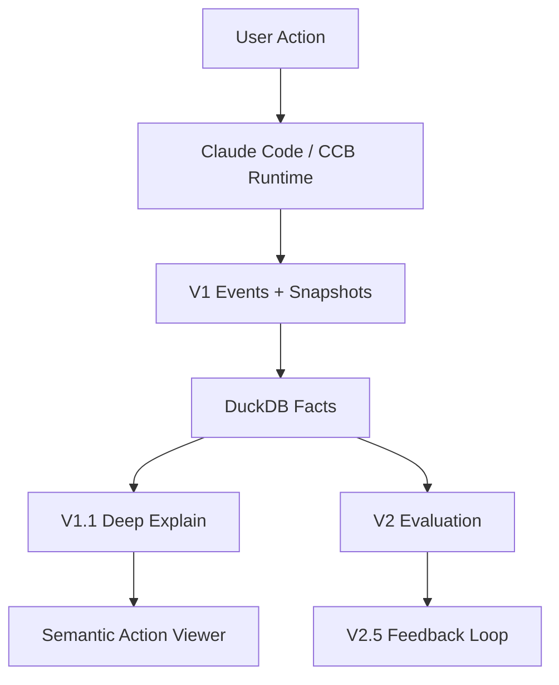

# CC 可观测系统

<p align="center">
  <strong>把一次 Claude Code / CCB user action 变成可回放、可下钻、可审计的本地调试面板。</strong>
</p>

<p align="center">
  <a href="https://github.com/claude-code-best/claude-code"></a>
  
  
  
  
</p>

> 本仓库来自原始 CCB 项目：[claude-code-best/claude-code](https://github.com/claude-code-best/claude-code)  
> 当前重点不是复述上游全部功能，而是把本地 observability、单 action 深解释、评测与反馈闭环做成一套可操作系统。

## 这次最重要的成果：Semantic Action Viewer

现在仓库里已经有一套可以直接打开的 **节点可视化调试面板**。它不是静态 Mermaid，而是一个本地交互 viewer：

- 能按 `action id` 搜索并打开单个 `user_action`
- 主线程固定在中间，按时间向下流动
- 子 query / 子 agent 从主线程两侧分叉展开
- 支持拖动画布、滚轮缩放、分支聚焦
- 点击任意节点后，可在右侧下钻查看：
  - `Overview`
  - `Dialogue`
  - `Tools`
  - `Artifacts`
  - `Evidence`
  - `Risk`
- `Dialogue` 不是原始 payload 直出，但保持忠实：
  - 保留 user / assistant / tool result / child query prompt-return
  - 不展示固定 system prompt
  - 不把多轮内容改写成模型没说过的话
- 不同 query / agent 有不同颜色
- `user` / `assistant` / `tool_result` / `assistant tool use` 在对话面板中分色显示
- 当子 query 完成并回到父线程后，可以画出 `return` 边

### 直接可看的入口

- 共享入口页：[ObservrityTask/action-reports/deep/semantic_viewer_app.html](ObservrityTask/action-reports/deep/semantic_viewer_app.html)
- 复杂样例：[ObservrityTask/action-reports/deep/user_action_semantic_complex/semantic_viewer.html](ObservrityTask/action-reports/deep/user_action_semantic_complex/semantic_viewer.html)
- 简单样例：[ObservrityTask/action-reports/deep/user_action_semantic_simple/semantic_viewer.html](ObservrityTask/action-reports/deep/user_action_semantic_simple/semantic_viewer.html)
- 配套说明：[ObservrityTask/action-reports/deep/README.md](ObservrityTask/action-reports/deep/README.md)

### 这个面板解决什么问题

传统日志只能回答“最后回复了什么”，这个 viewer 要回答的是：

1. 这次 action 的完整过程是什么？
2. 主线程在哪里，旁路分叉从哪里开始？
3. 什么时候开了子 agent，为什么开？
4. 它在每个 turn 里到底调用了什么工具？
5. 工具结果如何被后续步骤消费？
6. 子 query 的结果有没有返回给父线程？
7. 用户和模型在某个节点附近到底“说了什么”？

---

## 一句话定位

**CC 可观测系统** 是一套围绕 Claude Code / CCB 改造出的本地优先 Agent 调试与评测系统。

它的目标不是只记日志，也不是只做 dashboard，而是把一次真实 `user_action_id` 变成一条：

```text
user input
-> query loop
-> tool call
-> subagent
-> snapshot evidence
-> deep explain
-> compare / evaluate
-> feedback proposal
```

---

## 系统结构



---

## 当前最值得先看的能力

### 1. 单 action 深解释

围绕一个 `user_action_id` 展开：

- query
- turn
- tool
- subagent
- snapshot
- token / duration / compression

并生成深度报告、CSV、Mermaid 和交互 viewer。

入口代码：

- [scripts/observability/deep_explain_action.ts](scripts/observability/deep_explain_action.ts)
- [scripts/observability/lib/semantic_dialogue_viewer.ts](scripts/observability/lib/semantic_dialogue_viewer.ts)

### 2. 交互式节点面板

这是这轮新增的重点能力：

- 左侧按 `action id` 搜索
- 右侧大画布浏览整条链路
- 主线程居中
- 支路向两侧发散
- 点击节点即可看 faithful dialogue 和证据

### 3. 评测与反馈闭环

V2 之后的内容已经打通，但这里先压缩成一句话：

- `V2.1` 绑定已有 action 进入评测
- `V2.2` 自动执行 harness 并捕获 action
- `V2.3` 做 batch / robustness
- `V2.4` 做 long-context 专项
- `V2.5` 把实验结果沉淀成 feedback proposal

如果你先想理解仓库，建议**先看 viewer，再看 V2**。

---

## 快速开始

### 环境

- Bun
- Windows + PowerShell
- 本地 DuckDB 事实库

### 安装

```bash
bun install
```

### 开发

```bash
bun run dev
```

### 类型检查

```bash
bun run typecheck
```

---

## 生成单 action viewer

显式指定 action：

```bash
bun run scripts/observability/deep_explain_action.ts --user-action-id <USER_ACTION_ID> --selected-by explicit_user_action_id --output-dir ObservrityTask/action-reports/deep/<OUTPUT_DIR>
```

使用最新 action：

```bash
bun run scripts/observability/deep_explain_action.ts --latest --output-dir ObservrityTask/action-reports/deep/<OUTPUT_DIR>
```

生成后，优先打开：

- [ObservrityTask/action-reports/deep/semantic_viewer_app.html](ObservrityTask/action-reports/deep/semantic_viewer_app.html)

---

## 关键目录

- [scripts/observability](scripts/observability)
  - Deep explain、viewer、ETL、报告生成逻辑
- [ObservrityTask/action-reports/deep](ObservrityTask/action-reports/deep)
  - 已生成的 viewer、样例报告、README
- [tests/integration/semantic-dialogue-viewer.test.ts](tests/integration/semantic-dialogue-viewer.test.ts)
  - 节点图排序、fork、return、搜索页、布局等回归测试

---

## 当前状态

目前这套节点可视化已经能稳定表达：

- 主线程顺序
- 子 query 分叉
- 分支聚焦
- 返回父线程的 `return` 边
- faithful dialogue drill-down

当前仍然保留的边界：

- 不直接展示全量 API payload
- `compact` 相关标注仍可继续细化
- 某些回流关系只能按时序忠实推断，不能伪造不存在的父子映射

---

## 推荐阅读顺序

1. 先打开 [semantic_viewer_app.html](ObservrityTask/action-reports/deep/semantic_viewer_app.html)
2. 搜索一个 action，例如 `c6602631`
3. 从主线程往下看，再点 fork 节点
4. 打开节点右侧 `Dialogue` 面板
5. 再回头看 [ObservrityTask/action-reports/deep/README.md](ObservrityTask/action-reports/deep/README.md)
6. 最后再读 V2 相关实现
